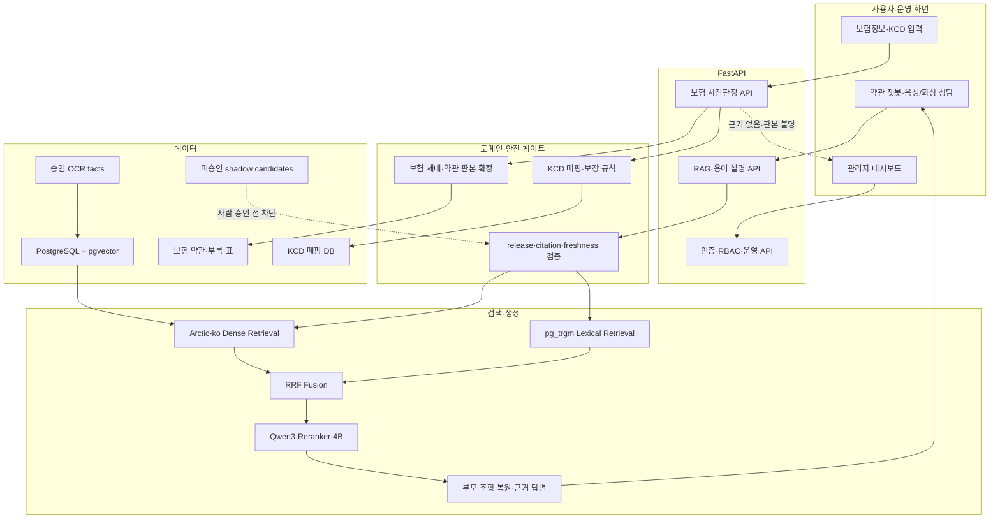

# 올바른 보험비서 — KCD 질병기호 × 실손보험 약관 사전판정

> 진료비 내역서의 **질병기호(KCD)** 와 **실손보험 약관**을 매칭해, 내가 청구했을 때 보장 가능한지를
> 약관 근거와 함께 미리 확인해주는 RAG 기반 보험 상담 서비스입니다.

<br/>

## 1. 팀 소개 — 팀명 "비서단"

| 이름 | 역할 |
|---|---|
| 송채영 |  |
| 김지혜 |  |
| 서유현 |  |
| 정재희 |  |
| 최연우 |  |

<br/>

## 2. WBS

> 세부 담당과 일정은 팀 WBS 정본을 기준으로 관리합니다. 아래 표는 현재 개발 단계와 상태입니다.

| 단계 | 주요 작업 | 담당 | 상태 |
|---|---|---|---|
| 1. 기획 | 주제 선정, 사용자 시나리오, 요구사항 정의 |  | 완료 |
| 2. 데이터 수집 | 보험사별·세대별 약관 PDF, KCD 질병기호, 공공데이터 수집 |  | 완료 |
| 3. 데이터 전처리 | 약관 구조화, 조항·부록 분리, 표·OCR 후보 복원, 품질 게이트 |  | 진행 중 |
| 4. 시스템 설계 | 아키텍처, DB 스키마, API와 팀 간 데이터 계약 설계 |  | 완료 |
| 5. 백엔드/DB 개발 | FastAPI, 인증·권한, PostgreSQL·pgvector, 관리자 기능 |  | 완료 |
| 6. RAG 파이프라인 개발 | 청킹, Arctic-ko 임베딩, Hybrid Retrieval, 리랭킹 |  | 완료 |
| 7. 프론트엔드 개발 | 보험정보 입력, 사전판정, 관리자·마이페이지 화면 |  | 완료 |
| 8. 통합 테스트 | 검색·판정 품질, 인용·보안·release 회귀 테스트 |  | 진행 중 |
| 9. 발표 준비 | 발표자료, 시연 시나리오, 팀 전달 패키지 |  | 진행 중 |

<br/>

## 3. 프로젝트 개요

실손보험은 **세대별(1~5세대)·보험사별로 약관 구조와 보장 조건이 달라** 소비자가 본인이 받은 진료의
보장 여부를 스스로 판단하기 어렵습니다. **올바른 보험비서**는 사용자가 보험 상품 정보와
진료비 내역의 질병기호를 입력하면 해당 판본의 약관을 검색하고, 보장·면책 근거와 추가로 확인할
사항을 함께 안내합니다.

현재 활성 릴리스는 `r2026-08-04-clause-s7.1-arctic-ko-ocr-approved`입니다. 사람 검수를 통과한
OCR 표 정보 850건만 검색 인덱스에 반영했으며, 미승인 후보는 검색과 인용에서 차단합니다.

<br/>

## 4. 프로젝트 소개

1. **보험정보 등록** — 상품명·보험사명·보험계약일 입력 → 보험 세대와 적용 약관 판본 확인
2. **질병기호 기반 보장 확인** — KCD 코드 또는 병명으로 관련 보장·면책 조항 검색
3. **약관 챗봇 상담** — 검색된 원문 조항을 근거로 답변하고 어려운 보험·의학 용어 설명
4. **OCR·표 정보 활용** — 자기부담금처럼 본문 추출이 어려운 표를 복원하고 사람 승인 후 반영
5. **관리자 대시보드** — 인덱스 상태, 문의 로그, 미해결 질의, 검증 큐와 운영 보고서 확인
6. **무폴백 판정** — 문서 판본·인덱스·근거가 불완전하면 임의 답변 대신 확인 불가 상태 반환

<br/>

## 5. 프로젝트 배경

- 실손보험 약관은 세대와 보험사마다 보장 범위·문서 양식이 달라 일반 소비자가 실제 보장 여부를
  판단하기 어렵습니다.
- 진료비 내역서에는 질병기호가 표기되지만, 이 코드를 가입한 상품의 정확한 약관 판본과 연결해
  설명하는 과정은 복잡합니다.
- 약관의 표·부록·각주에는 자기부담금, 지급률, 질병분류처럼 판정에 필요한 정보가 많지만 일반적인
  PDF 텍스트 추출만으로는 행·열 관계가 손실될 수 있습니다.
- 이에 팀 비서단은 **약관 문서(비정형) + KCD 코드(정형) + 사람 승인 OCR facts**를 연결해,
  사용자가 자신의 보험으로 청구 가능한지를 근거 중심으로 확인할 수 있는 서비스를 개발했습니다.

<br/>

## 6. 주요 기능

| 기능 | 설명 | 상태 |
|---|---|---|
| 세대별·보험사별 약관 RAG | 가입 상품과 계약일에 해당하는 약관 판본 안에서 관련 조항 검색 | 구현 |
| 질병명 → 질병코드 매칭 | KCD 코드를 모르는 사용자를 위한 병명·코드 검색 | 구현 |
| 보장 사전판정 | 질병기호, 상품 세대, 보장·면책 조항을 조합해 판정 상태 제공 | 구현 |
| 근거·인용 검증 | 검색 조각의 부모 조항을 복원하고 인용 가능성과 문서 신선도 검사 | 구현 |
| Hybrid Retrieval | Arctic-ko dense 검색과 pg_trgm lexical 검색을 RRF로 결합 | 구현 |
| Qwen3 리랭킹 | Qwen3-Reranker-4B로 top-k 후보 재정렬 | 구현 |
| OCR 표 복원 | 자기부담금 등 표 후보를 복구하고 사람 승인된 facts만 검색에 반영 | 구현 |
| 관리자 대시보드 | 인덱스 상태, 문의·이벤트, 지식갭, 검증 큐, PDF 보고서 | 구현 |
| 음성·화상 상담 | STT/TTS 상담과 얼굴 로그인 2차 인증 | 구현 |
| 장해 지급률·지연이자 후보 | B8/F4 후보 8,622 facts를 shadow로 검증 | 사람 승인 대기 |

<br/>

## 7. 기술 스택

| 영역 | 기술 | 적용 상태 |
|---|---|---|
| 언어 | Python 3.12 | 적용 |
| 백엔드 | FastAPI, Pydantic, SQLAlchemy | 적용 |
| RAG 오케스트레이션 | LangChain, LangGraph, 자체 포트·어댑터 계층 | 적용 |
| 임베딩 | `dragonkue/snowflake-arctic-embed-l-v2.0-ko` | 적용 |
| 리랭커 | `Qwen/Qwen3-Reranker-4B` | 적용 |
| 벡터 검색 | PostgreSQL + pgvector HNSW, FAISS | 적용 |
| 어휘 검색 | PostgreSQL `pg_trgm` | 적용 |
| 정형 DB | PostgreSQL, SQLite 개발 환경 | 적용 |
| PDF·OCR 전처리 | PyMuPDF 기반 구조 추출 + 선별 OCR 파이프라인 | 적용 |
| 프론트엔드 | HTML, CSS, Vanilla JavaScript | 적용 |
| 인증·보안 | JWT, RBAC, 얼굴 2차 인증, fail-closed gate | 적용 |
| 테스트·CI | pytest, GitHub Actions | 적용 |
| LLM | 로컬 OpenAI 호환 모델, OpenAI/Gemini 선택 구성 | 적용 |

<br/>

## 8. 프로젝트 구조

```text
app/
├─ application/         유스케이스와 포트
├─ adapters/            pgvector·파일·LLM·리랭커 어댑터
├─ core/                도메인 규칙, release, eligibility
├─ routers/             FastAPI REST API
├─ static/              고객·관리자 프론트엔드
├─ mcp/                 MCP 서버
└─ ml/                  음성·얼굴·의도 모델
config/                 승인 release와 모델·추출 설정
data/                   카탈로그, 평가셋, manifest
docs/handoff/           팀 간 데이터·API 계약과 인수인계
scripts/
├─ extract/             PDF·조항·표 전처리
├─ index/               청킹·임베딩·pgvector 적재
├─ eval/                검색·OCR·리랭커 평가
└─ manage.py            DB migration·ingest·운영 관리
tests/                  회귀·보안·계약 테스트
```

<br/>

## 9. 시스템 아키텍처



<br/>

## 10. 데이터 파이프라인

1. **수집** — 보험사별 실손보험 약관 PDF, 상품·판매기간, KCD 질병기호와 공공데이터 수집
2. **원본 보존** — 문서 SHA-256, 보험사, 상품명, 판매기간, 출처 URL과 원문 PDF 보존
3. **구조 추출** — 페이지 텍스트·좌표, 조항·항·호, 별표·붙임, 표 후보 추출
4. **선별 OCR** — 일반 추출로 충분한 페이지는 통과시키고 OCR이 필요한 표 후보만 GPU 처리
5. **품질 게이트** — 조항 경계, 표 축·금액·출처, citation eligibility와 중복 레이아웃 검증
6. **사람 승인** — candidate fact를 대표 패턴으로 축소해 원문 검수 후 승인·격리
7. **청킹·임베딩** — 승인 조항과 facts를 Arctic-ko로 임베딩해 pgvector에 적재
8. **검색·리랭킹** — dense+lexical 후보를 결합하고 Qwen3-Reranker-4B로 재정렬
9. **근거 답변** — 부모 조항과 원문 위치를 함께 반환하며 근거가 없으면 지식갭으로 기록

<br/>

## 11. 실행 파이프라인

```bash
# 1. 의존성 설치
pip install -r requirements.txt

# 2. 환경 설정
cp .env.example .env

# 3. DB 준비
python -m scripts.manage migrate

# 4. 기본 문서 인덱스
python -m scripts.manage ingest

# 5. PostgreSQL + pgvector 사용 시
python -m scripts.pg
python -m scripts.index.build_clause_index

# 6. API 실행
python -m uvicorn app.main:app --host 127.0.0.1 --port 8000

# 7. 준비 상태 확인
curl http://127.0.0.1:8000/api/health/ready
```

프론트엔드 실행:

```bash
python -m scripts.run_customer_server   # http://127.0.0.1:8080
python -m scripts.run_admin_server      # http://127.0.0.1:8081
```

<br/>

## 12. RAG 평가

| 평가 항목 | 현재 결과 |
|---|---|
| 평가 질의 | 417 |
| 전체 Hit@1 | 63.79% |
| 검색 가능한 질의 Hit@1 | 84.71% |
| 검색 가능한 질의 MRR@10 | 0.9101 |
| S7.1 top20 후보 쌍 | 8,285 |
| 승인 OCR fact 유입 | 23쌍 · 6질의 |
| 기존 정답 순위 회귀 | 0건 |
| 활성 인덱스 top20 지연 | p50 323ms · p95 364ms |
| 승인 OCR 동일 벡터 검사 | rank 1 · 거리 0 |

평가는 **근거성, 검색 정확도, 재현성, 환각 방지, 인용 가능성, 응답 품질**을 함께 확인합니다.
현재 평가셋은 기존 조항 검색 비회귀를 검증하며, 신규 자기부담금 facts 자체를 직접 평가하는 독립
holdout은 후속 과제로 남아 있습니다.

<br/>

## 13. 향후 계획

- [ ] B8 장해 지급률 26개 고유 패턴 사람 검수·승인
- [ ] F4 지연이자 9쪽 사람 검수·승인
- [ ] 승인 B8/F4 facts의 청크·임베딩·증분 인덱스 적재
- [ ] 신규 OCR facts 전용 독립 holdout 평가셋 구축
- [ ] 보험사·세대별 조항 span precision/recall 확대
- [ ] 동시 사용자 검색·리랭킹 부하 테스트와 운영 모니터링
- [ ] 배포 환경과 비밀정보·모델 캐시 전달 절차 확정

<br/>

## 14. 데이터 출처

- 질병 분류 기호 검색 — [kcdcode.kr](https://kcdcode.kr)
- 공공데이터포털 실손보험정보 API — [data.go.kr](https://www.data.go.kr)
- 보험협회 통합 약관 공시 — [pub.insure.or.kr](https://pub.insure.or.kr)
- 보험사별 상품·약관 공시 페이지
- 참고 유사 서비스 — [koicd.kr](https://koicd.kr)

> 본 서비스의 판정은 약관 원문 확인을 돕는 사전 안내이며, 보험금 지급 여부를 확정하는 법률·의학적
> 판단이 아닙니다. 실제 청구 결과는 보험사 심사와 계약 조건에 따라 달라질 수 있습니다.
