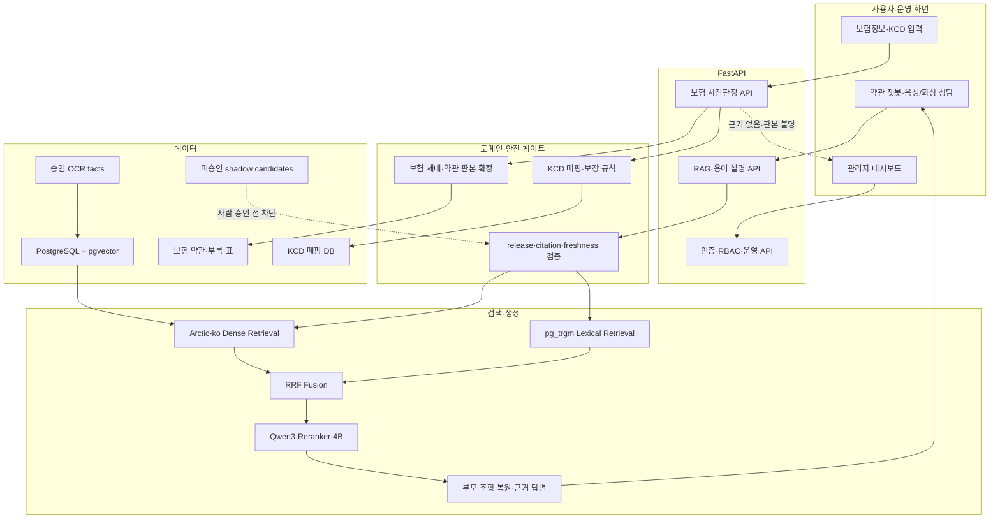

# 🏠 올바른 보험비서

> SK네트웍스 Family AI 캠프 32기 3차 프로젝트 4팀

---

## 1. 팀 소개

### 팀명

> 💼비서단

### 팀원

| 이름  | 파트                                                |
|-----|---------------------------------------------------|
| 송채영 | 👑팀장 │ 기획, 데이터 수집, 발표 준비, AI 파이프라인 개발             |
| 김지혜 | 💠팀원 │ 기획, 데이터 수집, 백엔드/DB 설계, 발표 준비               |
| 서유현 | 💠팀원 │ 기획, 데이터 수집, 데이터 전처리, AI 파이프라인 개발           |
| 정재희 | 💠팀원 │ 기획, 데이터 수집, AI 파이프라인 개발                    |
| 최연우 | 💠팀원 │ 기획, 데이터 전처리, 시스템 설계, 프론트엔드 개발, AI 파이프라인 개발 |

---

## 2. 프로젝트 개요
**KCD 질병기호와 실손보험 약관을 근거로 가입 전 보장 가능성을 확인하는 RAG 기반 보험 상담 플랫폼**
`올바른 보험비서`는 보험 약관에서 관련 조항을 검색하고, 가입자의 질병기호·보험사·상품 세대를 함께 대조해 판단 근거와 확인이 필요한 항목을 제공하는 팀 프로젝트입니다. 근거가 없거나 데이터 상태가 불완전하면 그럴듯한 답을 만들지 않고 명시적으로 중단하는 **무폴백(fail-closed)** 원칙을 적용합니다.

### 프로젝트 소개
- 약관 문서(비정형) + 질병코드(정형 데이터) 를 RAG로 연결해, 사용자가 자신의 보험으로 청구가 가능한지 사전에 확인할 수 있는 서비스입니다.
- 복잡하고 방대한 보험 약관 및 질병 코드를 AI 기반 RAG(검색증강생성) 기술로 정확히 탐색합니다.
- 일반 소비자, 실무자의 눈높이에 맞춰 맞춤형 안내를 제공하는 스마트 조회 솔루션입니다.

> ⚠️ 본 서비스는 보험 약관에 기반한 정보 안내 서비스이며, 개인이 가진 보험 증권의 특약 사항에 따라 보장은 달라질 수 있습니다.

### 프로젝트 배경 및 필요성

#### 기획 배경
- 보험약관의 중요성과 독해의 한계: 보험약관은 계약 체결과 보장 여부를 판단하는 핵심 근거 문서이나, 방대한 분량과 복잡한 전문용어로 인해 가입자가 내용을 꼼꼼히 확인하기 어렵습니다.  
- 실손보험의 복잡성 및 정보 불균형: 특히 실손보험 약관은 세대(1~5세대)와 보험사에 따라 보장 범위와 문서 양식이 크게 달라, 일반 소비자가 본인 진료가 실제로 보장되는지 판단하기 매우 어렵습니다.  
- 보장 여부 확인의 어려움: 진료비 내역서에 질병기호(KCD)가 표기되더라도, 이 코드가 실제 약관상 보장 대상인지 직접 연결하여 확인해 주는 서비스가 마땅치 않습니다.  
- 발생 문제: 이로 인해 약관의 조건부 보장이나 면책 조항 등을 인지하지 못하고 추후 보험금 청구 시 예상치 못한 보장 거절이나 불이익을 겪는 사례가 빈번하게 발생합니다.  


#### 기존 보험 관련 AI 서비스
질병분류정보센터 AI 서비스
- **KOICD 질병분류정보센터 - 보험담보 확인하기**
  - 특징: 주소 입력 시 집주인 신용 및 주택 위험도 24종 데이터 기반 보고서 즉시 발급
  - 한계: 근거 자료 통계적 학습 데이터 (특정 약관 미근거, 할루시네이션 우려), 정확한 조항 확인 불가, 일반적 답변 제공
  - 링크: https://www.koicd.kr/ins/claimableList.do

> **명확한 문서를 근거로 질의응답할 수 있는 서비스는 현재 존재하지 않음!**

---

### 프로젝트 목표

💡**서비스 포지셔닝**:
우리 서비스는 사람 고객 뿐만 아니라 API로 접근하는 AI 에이전트도 고객 범주에 포함하였습니다. 
그 이유는 현재 웹상에서 AI 에이전트 및 자동화된 봇의 이용량(트래픽 비중)이 인간 유저의 비중보다 훨씬 많기 때문입니다. 
이에 대한 근거는 글로벌 보안 및 인프라 기업들의 공식 데이터와 보고서를 통해 입증되고 있습니다.

근거자료:
- 글로벌 웹 트래픽의 상당 부분을 처리하는 인프라 기업 클라우드플레어(Cloudflare)의 네트워크 데이터에 따르면, 인터넷 역사상 최초로 봇과 AI 에이전트가 생성하는 트래픽이 인간의 트래픽을 추월했습니다.   
웹사이트에 들어오는 전체 요청 중 봇과 AI 에이전트가 차지하는 비중은 57.4%를 기록한 반면, 인간 유저는 42.6%에 그쳤습니다.  

- 사이버 보안 기업 휴먼 보안이 발행한 보고서에 따르면, 전체 자동화 트래픽 중에서도 단순 데이터 수집용 크롤러를 넘어 실시간으로 웹과 상호작용하는 'AI 에이전트 및 에이전틱 브라우저' 트래픽이 전년 대비 수천 퍼센트 이상 급증했습니다.  
인간 소비자가 상품을 구매하거나 정보를 찾을 때 평균 5개 정도의 웹사이트를 방문하는 반면, AI 에이전트는 동일한 작업을 수행하기 위해 수천 개(최대 수천 배 이상)의 웹페이지를 자율적으로 방문하여 방대한 데이터를 비교·탐색합니다.  
  
  
### 서비스 확장 가능성
- **상품군 확장:** 실손보험에서 출발하여 **암보험, 종신보험, 어린이보험, 최근 수요가 급증하는 펫보험(반려동물 보험)** 등으로 데이터 및 도메인 확장.  
- **기능 확장:** 가입 중인 실제 보험 증권(이미지/마이데이터)과 연동하여 "내가 가입한 상품 기준으로 보장받을 수 있는지" 개인화된 진단 서비스로 발전.  

## 3. WBS
| 단계 | 주요 작업 | 담당 | 상태   |
|---|---|---|------|
| 1. 기획 | 주제 선정, 사용자 시나리오, 요구사항 정의 |  | 완료   |
| 2. 데이터 수집 | 보험사별·세대별 약관 PDF, KCD 질병기호, 공공데이터 수집 |  | 완료   |
| 3. 데이터 전처리 | 약관 구조화, 조항·부록 분리, 표·OCR 후보 복원, 품질 게이트 |  | 진행 중 |
| 4. 시스템 설계 | 아키텍처, DB 스키마, API와 팀 간 데이터 계약 설계 |  | 완료   |
| 5. 백엔드/DB 개발 | FastAPI, 인증·권한, PostgreSQL·pgvector, 관리자 기능 |  | 완료   |
| 6. RAG 파이프라인 개발 | 청킹, Arctic-ko 임베딩, Hybrid Retrieval, 리랭킹 |  | 완료   |
| 7. 프론트엔드 개발 | 보험정보 입력, 사전판정, 관리자·마이페이지 화면 |  | 완료   |
| 8. 통합 테스트 | 검색·판정 품질, 인용·보안·release 회귀 테스트 |  | 완료   |
| 9. 발표 준비 | 발표자료, 시연 시나리오, 팀 전달 패키지 |  | 완료   |

<br/>

## 4. 프로젝트 개요

실손보험은 **세대별(1~5세대)·보험사별로 약관 구조와 보장 조건이 달라** 소비자가 본인이 받은 진료의
보장 여부를 스스로 판단하기 어렵습니다. **올바른 보험비서**는 사용자가 보험 상품 정보와
진료비 내역의 질병기호를 입력하면 해당 판본의 약관을 검색하고, 보장·면책 근거와 추가로 확인할
사항을 함께 안내합니다.

현재 활성 릴리스는 `r2026-08-04-clause-s7.1-arctic-ko-ocr-approved`입니다. 사람 검수를 통과한
OCR 표 정보 850건만 검색 인덱스에 반영했으며, 미승인 후보는 검색과 인용에서 차단합니다.

<br/>

## 5. 프로젝트 소개

1. **보험정보 등록** — 상품명·보험사명·보험계약일 입력 → 보험 세대와 적용 약관 판본 확인
2. **질병기호 기반 보장 확인** — KCD 코드 또는 병명으로 관련 보장·면책 조항 검색
3. **약관 챗봇 상담** — 검색된 원문 조항을 근거로 답변하고 어려운 보험·의학 용어 설명
4. **OCR·표 정보 활용** — 자기부담금처럼 본문 추출이 어려운 표를 복원하고 사람 승인 후 반영
5. **관리자 대시보드** — 인덱스 상태, 문의 로그, 미해결 질의, 검증 큐와 운영 보고서 확인
6. **무폴백 판정** — 문서 판본·인덱스·근거가 불완전하면 임의 답변 대신 확인 불가 상태 반환

<br/>

## 6. 프로젝트 배경

- 실손보험 약관은 세대와 보험사마다 보장 범위·문서 양식이 달라 일반 소비자가 실제 보장 여부를
  판단하기 어렵습니다.
- 진료비 내역서에는 질병기호가 표기되지만, 이 코드를 가입한 상품의 정확한 약관 판본과 연결해
  설명하는 과정은 복잡합니다.
- 약관의 표·부록·각주에는 자기부담금, 지급률, 질병분류처럼 판정에 필요한 정보가 많지만 일반적인
  PDF 텍스트 추출만으로는 행·열 관계가 손실될 수 있습니다.
- 이에 팀 비서단은 **약관 문서(비정형) + KCD 코드(정형) + 사람 승인 OCR facts**를 연결해,
  사용자가 자신의 보험으로 청구 가능한지를 근거 중심으로 확인할 수 있는 서비스를 개발했습니다.

<br/>

## 7. 주요 기능

| 기능 | 설명 |
|---|---|
| 세대별·보험사별 약관 RAG | 가입 상품과 계약일에 해당하는 약관 판본 안에서 관련 조항 검색 |
| 질병명 → 질병코드 매칭 | KCD 코드를 모르는 사용자를 위한 병명·코드 검색 |
| 보장 사전판정 | 질병기호, 상품 세대, 보장·면책 조항을 조합해 판정 상태 제공 |
| 근거·인용 검증 | 검색 조각의 부모 조항을 복원하고 인용 가능성과 문서 신선도 검사 |
| Hybrid Retrieval | Arctic-ko dense 검색과 pg_trgm lexical 검색을 RRF로 결합 |
| Qwen3 리랭킹 | Qwen3-Reranker-4B로 top-k 후보 재정렬 |
| OCR 표 복원 | 자기부담금 등 표 후보를 복구하고 사람 승인된 facts만 검색에 반영 |
| 관리자 대시보드 | 인덱스 상태, 문의·이벤트, 지식갭, 검증 큐, PDF 보고서 |
| 음성·화상 상담 | STT/TTS 상담과 얼굴 로그인 2차 인증 |
| 장해 지급률·지연이자 후보 | B8/F4 후보 8,622 facts를 shadow로 검증 |

<br/>

## 8. 기술 스택

| 영역 | 기술 |
|---|---|
| 언어 | Python 3.12 |
| 백엔드 | FastAPI, Pydantic, SQLAlchemy |
| RAG 오케스트레이션 | LangChain, LangGraph, 자체 포트·어댑터 계층 |
| 임베딩 | `dragonkue/snowflake-arctic-embed-l-v2.0-ko` |
| 리랭커 | `Qwen/Qwen3-Reranker-4B` |
| 벡터 검색 | PostgreSQL + pgvector HNSW, FAISS |
| 어휘 검색 | PostgreSQL `pg_trgm` |
| 정형 DB | PostgreSQL, SQLite 개발 환경 |
| PDF·OCR 전처리 | PyMuPDF 기반 구조 추출 + 선별 OCR 파이프라인 |
| 프론트엔드 | HTML, CSS, Vanilla JavaScript |
| 인증·보안 | JWT, RBAC, 얼굴 2차 인증, fail-closed gate |
| 테스트·CI | pytest, GitHub Actions |
| LLM | 로컬 OpenAI 호환 모델, OpenAI/Gemini 선택 구성 |

<br/>

## 9. 프로젝트 구조

```text
app/
├─ application/         유스케이스와 포트
├─ adapters/            pgvector·파일·LLM·리랭커 어댑터
├─ core/                도메인 규칙, release, eligibility
├─ routers/             FastAPI REST API
├─ static/              고객·관리자 프론트엔드
├─ mcp/                 MCP 서버
└─ ml/                  음성·얼굴·의도 모델
config/                 승인 release와 모델·추출 설정
data/                   카탈로그, 평가셋, manifest
docs/handoff/           팀 간 데이터·API 계약과 인수인계
scripts/
├─ extract/             PDF·조항·표 전처리
├─ index/               청킹·임베딩·pgvector 적재
├─ eval/                검색·OCR·리랭커 평가
└─ manage.py            DB migration·ingest·운영 관리
tests/                  회귀·보안·계약 테스트
```

<br/>

## 10. 시스템 아키텍처



<br/>

## 11. 데이터 파이프라인

1. **수집** — 보험사별 실손보험 약관 PDF, 상품·판매기간, KCD 질병기호와 공공데이터 수집
2. **원본 보존** — 문서 SHA-256, 보험사, 상품명, 판매기간, 출처 URL과 원문 PDF 보존
3. **구조 추출** — 페이지 텍스트·좌표, 조항·항·호, 별표·붙임, 표 후보 추출
4. **선별 OCR** — 일반 추출로 충분한 페이지는 통과시키고 OCR이 필요한 표 후보만 GPU 처리
5. **품질 게이트** — 조항 경계, 표 축·금액·출처, citation eligibility와 중복 레이아웃 검증
6. **사람 승인** — candidate fact를 대표 패턴으로 축소해 원문 검수 후 승인·격리
7. **청킹·임베딩** — 승인 조항과 facts를 Arctic-ko로 임베딩해 pgvector에 적재
8. **검색·리랭킹** — dense+lexical 후보를 결합하고 Qwen3-Reranker-4B로 재정렬
9. **근거 답변** — 부모 조항과 원문 위치를 함께 반환하며 근거가 없으면 지식갭으로 기록

<br/>

## 12. 실행 파이프라인

```bash
# 1. 의존성 설치
pip install -r requirements.txt

# 2. 환경 설정
cp .env.example .env

# 3. DB 준비
python -m scripts.manage migrate

# 4. 기본 문서 인덱스
python -m scripts.manage ingest

# 5. PostgreSQL + pgvector 사용 시
python -m scripts.pg
python -m scripts.index.build_clause_index

# 6. API 실행
python -m uvicorn app.main:app --host 127.0.0.1 --port 8000

# 7. 준비 상태 확인
curl http://127.0.0.1:8000/api/health/ready
```

프론트엔드 실행:

```bash
python -m scripts.run_customer_server   # http://127.0.0.1:8080
python -m scripts.run_admin_server      # http://127.0.0.1:8081
```

<br/>

## 13. RAG 평가

| 평가 항목 | 현재 결과 |
|---|---|
| 평가 질의 | 417 |
| 전체 Hit@1 | 63.79% |
| 검색 가능한 질의 Hit@1 | 84.71% |
| 검색 가능한 질의 MRR@10 | 0.9101 |
| S7.1 top20 후보 쌍 | 8,285 |
| 승인 OCR fact 유입 | 23쌍 · 6질의 |
| 기존 정답 순위 회귀 | 0건 |
| 활성 인덱스 top20 지연 | p50 323ms · p95 364ms |
| 승인 OCR 동일 벡터 검사 | rank 1 · 거리 0 |

평가는 **근거성, 검색 정확도, 재현성, 환각 방지, 인용 가능성, 응답 품질**을 함께 확인합니다.
현재 평가셋은 기존 조항 검색 비회귀를 검증하며, 신규 자기부담금 facts 자체를 직접 평가하는 독립
holdout은 후속 과제로 남아 있습니다.


## 14. 데이터 출처

- 질병 분류 기호 검색 — [kcdcode.kr](https://kcdcode.kr)
- 공공데이터포털 실손보험정보 API — [data.go.kr](https://www.data.go.kr)
- 보험협회 통합 약관 공시 — [pub.insure.or.kr](https://pub.insure.or.kr)
- 보험사별 상품·약관 공시 페이지
- 참고 유사 서비스 — [koicd.kr](https://koicd.kr)

> 본 서비스의 판정은 약관 원문 확인을 돕는 사전 안내이며, 보험금 지급 여부를 확정하는 법률·의학적
> 판단이 아닙니다. 실제 청구 결과는 보험사 심사와 계약 조건에 따라 달라질 수 있습니다.
