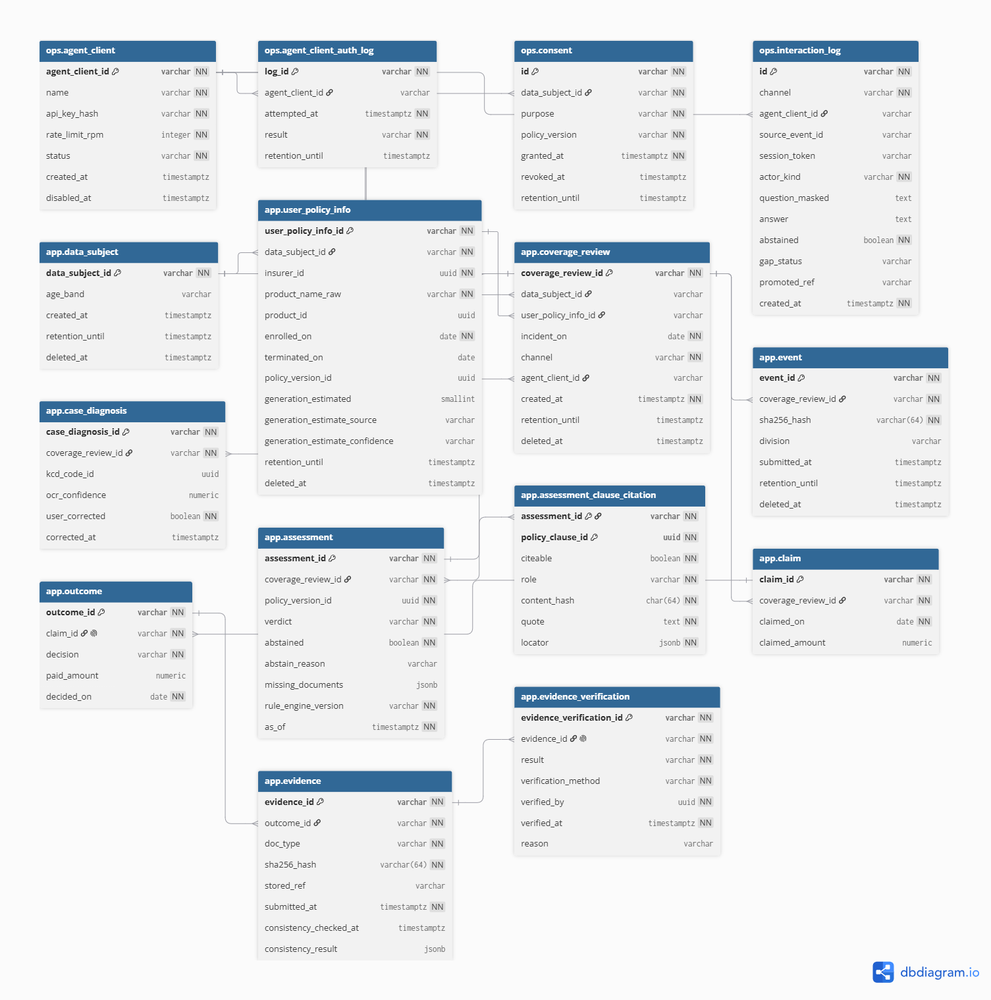

# 올바른 보험 비서 — 서비스 설계 문서


## 1. 서비스 흐름 개요

```
[진입]
  channel 판별: web(직접 접속) | agent(외부 API 클라이언트 경유)
    ├─ web:   app.data_subject 식별 또는 신규 생성 (1회 익명이면 NULL 허용)
    └─ agent: ops.agent_client 인증(api_key_hash) + app.data_subject 지정/신규 생성
  ※ 세션 자체는 DB 테이블로 만들지 않는다 (ERD v4 §7 확정사항).
    "지금 화면에 뭘 보여줄지"는 애플리케이션 계층(쿠키/토큰)이 들고 있는다.
              │
              ▼
[화면 1] 보험정보 입력 (선택) — 이 시점엔 사고일을 묻지 않는다
  상품명 / 보험사명 / 보험계약일시(가입일) 입력
              │
     ┌────────┴──────────────────┐
    등록                    다음에 할게요
     │                            │
     ▼                            │
  app.user_policy_info 생성       │
  (data_subject_id,               │
   insurer_id,                    │
   product_name_raw,              │
   product_id[매칭시만],          │
   enrolled_on,                   │
   generation_estimated)          │
     │                            │
     ▼                            │
  앱 세션(쿠키/토큰)에             │
  user_policy_info_id 저장         │
  (상단 정보 바 표시용)            │
     │                            │
     └─────────────┬──────────────┘
                    ▼
[화면 2] 챗봇 서비스 화면
  (등록했다면 상단에 상품 정보 요약 표시
   — 앱 세션의 user_policy_info_id 기준, coverage_review 불필요)
              │
              ▼
  채팅 턴마다 → ops.interaction_log 1행 기록
  (channel, question_masked, answer, actor_kind, abstained, gap_status)
              │
              ▼
  실제 질병·사고 문의 시작
  → 챗봇이 사고일(incident_on)을 물어봄
              │
              ▼
  app.coverage_review 생성
  (data_subject_id[스킵/익명이면 NULL],
   user_policy_info_id[스킵이면 NULL],
   incident_on, channel, agent_client_id)
  → 앱 세션(쿠키/토큰)에 coverage_review_id 저장
              │
              ▼
  증빙서류 제출 시 → app.event 생성 (coverage_review_id 연결)
```

---

## 2. 화면별 와이어프레임 설명

### 화면 1 · 보험정보 입력

| 요소 | 타입 | 설명 |
|---|---|---|
| 타이틀 | 텍스트 | "가지고 계신 보험 정보를 입력해주세요" |
| 상품명 | input | placeholder: `예) 다이렉트실손의료보험`. 자유 입력 — `product_name_raw`로 저장, `core.product` 매칭은 선택적(4.3절) |
| 보험사명 | select | placeholder: `보험사 선택`. **옵션은 `core.insurer.display_name` 12개사에서 조회** — 선택이라 항상 정확히 매칭됨 |
| 보험계약일시(가입일) | input | placeholder: `예) 20260801`. `app.user_policy_info.enrolled_on`에 저장 |
| 등록 버튼 | button | `app.user_policy_info` 생성(`insurer_id` 확정 연결 + `product_name_raw` 저장 + `core.product` 매칭 시도), 앱 세션(쿠키/토큰)에 `user_policy_info_id` 저장 후 화면 2로 이동. **이 시점엔 `app.coverage_review`를 만들지 않는다** (아직 사고가 없을 수 있으므로) |
| 다음에 할게요 버튼 | button | `app.user_policy_info` 미생성, 앱 세션에 정보 없이 화면 2로 이동 |

> **사고일은 화면 1에서 받지 않는다.** 보험정보(계약)와 사고 발생은 서로 다른 시점의 사건이라, "보험정보는 있지만 아직 사고는 없는" 상태를 표현하려면 둘을 같은 화면·같은 시점에 묶어 받으면 안 된다. 사고일은 화면 2에서 실제 질병·사고 문의가 시작될 때 챗봇이 물어본다.

### 화면 2 · 챗봇 서비스

| 요소 | 설명 |
|---|---|
| 상단 정보 바 | 보험정보를 입력한 경우에만 노출. **앱 세션(쿠키/토큰)에 저장된 `user_policy_info_id`**로 `app.user_policy_info`를 조회해 보험사명, 상품명, 세대 정보(`generation_estimated`, 확정 안 됐으면 "추정" 표기 권장)를 표시. DB에 별도 세션 테이블이 없으므로 이 상태는 서버가 아니라 클라이언트 세션이 들고 있는다 |
| 챗봇 인사말 | "질병코드로 보장여부를 확인할 수 있습니다. 질병코드를 모른다면 병명을 입력해보세요. 어려운 보험 용어를 쉽게 설명해드려요." |
| 채팅 입력창 + 보내기 버튼 | 입력한 질문마다 `ops.interaction_log`에 한 행 기록(질의는 마스킹). **실제 질병·사고 문의로 판단되면** 챗봇이 사고일을 물어보고, 답변을 받으면 그 시점에 `app.coverage_review`를 생성해 앱 세션에 `coverage_review_id`를 저장한다 |

---

## 3. 최종 DB 스키마

🔗링크: https://dbdiagram.io/d/6a6e1ac5067336e1de404869

> **스키마(네임스페이스) 매핑 근거**: `erd_tables.html`의 `core`/`app`/`ops` 3분류를 기준으로 우리 테이블에 접두사를 붙였다.
> - `ops` (운영·거버넌스, 인증/상호작용 로그/동의): `agent_client`, `agent_client_auth_log`, `interaction_log`, `consent`
> - `app` (핵심 업무 데이터, 실제 사람·계약·심사): `data_subject`, `user_policy_info`, `coverage_review`, `event`
> - `core` (참조/카탈로그 데이터, `001_core.sql`에 이미 존재 — 우리가 만들지 않음): `insurer`, `product`, `policy_version` 등
>
> PostgreSQL은 스키마가 달라도 FK 참조에 제약이 없어 `app.user_policy_info.insurer_id → core.insurer.id`처럼 **크로스 스키마 FK가 정상 동작**한다.

> **⚠ `ops.session_manager` 폐기 (2026-08-03 교차검증 반영)**: ERD v4 §7 확정사항 — **"session 테이블을 만들지 않는다. 세션 흐름은 `ops.interaction_log`가 받는다."** 저희가 만들었던 `session_id`/`chatbot_count`/`expires_at` 컬럼은 전부 제거했다. `chatbot_count`처럼 `UPDATE`로 관리하는 카운터 컬럼은 통계를 오염시킬 위험이 있어, 로그 집계로 대체하는 게 원칙이다. "지금 화면에 뭘 보여줄지"(예: 상단 정보 바에 표시할 `user_policy_info_id`)는 DB가 아니라 애플리케이션 세션(쿠키/토큰)이 들고 있는다.

### ops.agent_client (외부 API 호출자 — 구 `agent` + `agent_credential` 통합, 명칭 통일)
| 컬럼 | 타입 | 제약 | 설명 |
|---|---|---|---|
| `agent_client_id` | VARCHAR | PK, NOT NULL | 불변 식별자. 인증정보(`api_key_hash`)와 개념적으로 분리해서 생각한다 |
| `name` | VARCHAR | NOT NULL | 파트너/클라이언트 명 |
| `api_key_hash` | VARCHAR | NOT NULL | 인증키 해시값. **교체 가능** — 유출 시 이것만 갈아끼운다 (평문 저장 금지) |
| `rate_limit_rpm` | INTEGER | NOT NULL | 분당 호출 제한. API 클라이언트는 사람보다 수백 배 빠르게 호출할 수 있어 필요 |
| `status` | VARCHAR | NOT NULL | 계정 상태 (예: `active`, `disabled`) |
| `created_at` | TIMESTAMPTZ | | 등록 시각 |
| `disabled_at` | TIMESTAMPTZ | NULL 허용 | 비활성화 시각 |

> **범위가 명확해졌습니다: `ops.agent_client`는 WEB 브라우저 접속을 포함하지 않습니다.** `app.coverage_review.channel`/`ops.interaction_log.channel`이 `'agent'`일 때만 `agent_client_id`가 채워지고, `'web'`이면 NULL입니다. WEB 접속자는 이 테이블에 행을 만들지 않고 `app.data_subject`로 곧장 식별됩니다.
> **고객(데이터 주체) 식별자로 쓰지 않습니다.** 인증 주체(누가 호출했나)와 데이터 주체(누구의 데이터인가)는 다릅니다 — `app.data_subject`와는 별개 테이블로 유지합니다.
> 이전 `agent_credential`(별도 테이블, 1:1)의 역할을 `api_key_hash` 컬럼 하나로 흡수해 테이블을 통합했습니다.
> **원칙적으로 물리 삭제하지 않습니다** — 비활성화는 `status = 'disabled'` + `disabled_at`으로만 처리합니다.

### ops.agent_client_auth_log (인증 시도 로그)
| 컬럼 | 타입 | 제약 | 설명 |
|---|---|---|---|
| `log_id` | VARCHAR | PK, NOT NULL | 로그 ID (UUID 등) |
| `agent_client_id` | VARCHAR | FK → ops.agent_client, NULL 허용 | 인증을 시도한 클라이언트. **정책상 물리 삭제되지 않아야 하지만, 방어적으로 NULL 허용**(아래 참고) |
| `attempted_at` | TIMESTAMPTZ | NOT NULL | 인증 시도 시각 |
| `result` | VARCHAR | NOT NULL | `SUCCESS` \| `FAILURE` |
| `retention_until` | TIMESTAMPTZ | NULL 허용 | 로그 보존기한 |

> **`agent_client` 소프트 삭제 정책**: `ops.agent_client_auth_log.agent_client_id`의 `ON DELETE SET NULL`은 원래 "행은 남기되 삭제된 클라이언트와의 연결만 끊는다"는 의도였는데, 이러면 **"누가 이 인증을 시도했는지"라는 감사 정보 자체가 사라진다.** 그래서 운영 정책을 바꾼다: **`ops.agent_client`는 원칙적으로 물리 삭제(`DELETE`)하지 않고, `status = 'disabled'` + `disabled_at`으로만 비활성화한다.** 이렇게 하면 `agent_client_id`가 항상 살아있으니 `auth_log`의 귀속 정보가 보존된다. `ON DELETE SET NULL` 자체는 실수로 삭제되는 경우에 대비한 방어용으로만 남겨두고, 정상 운영에서는 발동될 일이 없어야 한다.

### ops.consent (동의 원장: 4개 테이블에 흩어졌던 동의 시각을 여기로 통합)

> **통합 근거**: `app.data_subject.consent_at`, `app.user_policy_info.consent`, `app.coverage_review.consent`, `app.event.consent` 네 컬럼으로 흩어져 있던 "동의 시각"을 참고 문서(`erd_tables.html`)의 `ops.consent` 구조를 그대로 채택해 단일 원장으로 통합했다. 문제는 컬럼이 여러 테이블에 반복되는 것 자체가 아니라, **단일 동의 원장과 철회·삭제 전파 수단(FK·트리거·작업)이 없었다는 것**이었다. `retention_until`은 이 통합과 별개로 각 테이블에 그대로 둔다 — 보존기한은 레코드(데이터)별로 달라도 되는 값이라, 동의(행위) 이력과 성격이 다르다.
>
> ⚠️ **`001_core.sql` 실물 확인 결과**: 이 원장은 아직 실제로 만들어져 있지 않다. 파일 맨 위에 `ops.consent`를 **의도적으로 제외**한다는 주석이 있다 — `consent.subject_id → app.subject` FK가 필요한데 `app.subject`(저희의 `app.data_subject`)가 아직 P2(후순위)라 만들 수 없었다는 이유다. 즉 "이미 있는 원장에 흡수"가 아니라 **저희가 `app.data_subject`와 함께 이번에 처음 만드는 것**이다. 저희가 `app.*` 전체를 새로 작성하면서 그 선행조건(subject 존재)이 자연히 풀리므로, `ops.consent`도 이번에 함께 만들면 된다.

| 컬럼 | 타입 | 제약 | 설명 |
|---|---|---|---|
| `id` | VARCHAR | PK, NOT NULL | 동의 레코드 ID |
| `data_subject_id` | VARCHAR | FK → app.data_subject, NOT NULL | **단방향.** `data_subject.consent_id`처럼 역참조 컬럼을 두지 않는다 |
| `purpose` | VARCHAR | NOT NULL | 동의 목적. **목적별로 행이 늘어난다**(아래 목적 값 참고) |
| `policy_version` | VARCHAR | NOT NULL | 동의서(약관) 버전 |
| `granted_at` | TIMESTAMPTZ | NOT NULL | 동의 시각 |
| `revoked_at` | TIMESTAMPTZ | NULL 허용 | 철회 시각 |
| `retention_until` | TIMESTAMPTZ | NULL 허용 *(타입 수정: DATE→TIMESTAMPTZ, 다른 테이블과 통일)* | 이 동의 레코드 자체의 보존기한 |

**`purpose` 값 매핑** (기존에 흩어져 있던 4개 컬럼과의 대응 관계)

| 기존 컬럼 (제거됨) | 대응하는 `purpose` 값 |
|---|---|
| `app.data_subject.consent_at` | `service_use` (서비스 전체 이용 동의) |
| `app.user_policy_info.consent` | `policy_info_analysis` (보험정보 분석 목적 동의) |
| `app.coverage_review.consent` | `case_review` (사전검토 목적 동의) |
| `app.event.consent` | `evidence_submission` (증빙서류 제출 동의) |

> **철회·삭제 전파**: `revoked_at`이 채워지면, 해당 `purpose`와 관련된 데이터(예: `evidence_submission` 철회 시 미검증 `app.event`)를 어떻게 처리할지는 **트리거 또는 애플리케이션 로직으로 아직 구현되지 않았다** — 7절 참고.
>
> ⚠️ **정정(모순 수정, 5번)**: 예전엔 "`ops.consent`에 `service_use` 동의 행이 없으면 `app.user_policy_info`를 생성할 수 없다는 규칙이 이 원장 하나로 **강제된다**"고 적어놨는데, 사실이 아니다. `ops.consent.data_subject_id`는 그냥 `app.data_subject`를 가리키는 FK일 뿐, **`app.user_policy_info`/`app.coverage_review`/`app.event`가 대응하는 `ops.consent` 행의 존재를 요구하는 FK·CHECK·트리거는 어디에도 없다.** B절(판정 사슬)에서는 "FK가 없으면 못 넣는 구조"를 원칙으로 강조해놓고 정작 동의 요구사항은 순수 애플리케이션 로직(코드 레벨 검사)에만 의존하는 이중 잣대였다. **지금은 애플리케이션 레벨 규칙일 뿐이라고 정확히 표현한다** — DB 레벨로 강제하려면 트리거나 `CHECK` 제약(예: 관련 `purpose`의 `ops.consent` 행 존재 여부를 확인하는 `BEFORE INSERT` 트리거)이 추가로 필요하며, 아직 미구현이다(7절 참고).

### ops.interaction_log (상호작용 기록 — `session_manager` 대체, `core` FK 없음)

> **명명·설계 근거**: `ops.session_manager`를 폐기하며 참고 문서(`erd_tables.html`)의 `ops.interaction_log` 구조를 그대로 채택했다. 이 테이블은 의도적으로 `core`(약관·상품)로 가는 FK가 **없다** — 즉 **판정 근거로 쓸 수 없는 구조**다. "나중에 이 채팅 로그도 판정 근거로 쓰자"는 요구가 들어와도 FK가 없어서 구조적으로 막힌다. 중복 제출 방지의 1차 방어선도 이 테이블의 ID가 아니라 `app.evidence_verification`(사람의 검증)이며, `UNIQUE` 제약은 보조 수단일 뿐이다.
>
> **`session_token`을 추가한 이유**: "이 세션이 챗봇을 몇 번 썼는지" 같은 집계가 필요한데, 원본 참고 구조엔 세션을 묶을 키가 없었다. 카운터 컬럼(`chatbot_count`처럼 `UPDATE`로 증감)을 다시 넣으면 F에서 걷어낸 문제가 재발하므로, 대신 **앱 세션(쿠키/토큰)이 발급한 불투명한 상관관계 키**를 그대로 흘려보내는 컬럼만 추가했다. `core`/`app`으로 가는 FK가 아니라서 "판정 근거로 못 쓴다"는 원칙은 그대로 유지된다. 집계는 저장이 아니라 조회 시점 `COUNT(*) ... WHERE session_token = ?`으로 처리한다.

| 컬럼 | 타입 | 제약 | 설명 |
|---|---|---|---|
| `id` | VARCHAR | PK, NOT NULL | 로그 ID |
| `channel` | VARCHAR | NOT NULL | `web` \| `agent` |
| `agent_client_id` | VARCHAR | FK → ops.agent_client, NULL 허용 | `channel = 'agent'`일 때만 사용 |
| `source_event_id` | VARCHAR | NULL 허용 | `UNIQUE (agent_client_id, source_event_id)` — 중복 제출 차단(보조 수단) |
| `session_token` | VARCHAR | NULL 허용 | **FK 아님.** 앱 세션(쿠키/토큰)이 발급한 상관관계 키. "몇 번 썼는지" 집계는 이 값 기준으로 조회 시점에 `COUNT`한다 |
| `actor_kind` | VARCHAR | NOT NULL | `declared`(사용자가 명시) \| `inferred`(추론) \| `unknown` |
| `question_masked` | TEXT | NULL 허용 | 개인정보를 마스킹한 질의 원문 |
| `answer` | TEXT | NULL 허용 | 챗봇 답변 |
| `abstained` | BOOLEAN | NOT NULL | 챗봇이 답변을 기권했는가 |
| `gap_status` | VARCHAR | NULL 허용 | `open` \| `reviewed` \| `promoted` \| `rejected` — 지식갭 처리 상태 |
| `promoted_ref` | VARCHAR | NULL 허용 | 지식갭이 승격된 경우 대상 참조 |
| `created_at` | TIMESTAMPTZ | NOT NULL | 상호작용 발생 시각 |

> **`data_subject_id`가 없습니다.** 이 로그는 "누가 물었는가"를 추적하는 신원 기록이 아니라, "어떤 질의·응답이 오갔는가"를 익명화된 형태로 남기는 FAQ/지식갭 분석용 로그입니다. 세션당 챗봇 이용 횟수는 `session_token` 기준 `COUNT`로 집계합니다(위 참고).

### app.data_subject (데이터 주체 — 실제 개인)
| 컬럼 | 타입 | 제약 | 설명 |
|---|---|---|---|
| `data_subject_id` | VARCHAR | PK, NOT NULL | 실제 개인 식별자 (계약/의료 정보의 진짜 주인) |
| `age_band` | VARCHAR | NULL 허용 | 연령대 구간. **생년월일·출생연도는 저장하지 않음** |
| `created_at` | TIMESTAMPTZ | | 최초 생성 시각 |
| `retention_until` | TIMESTAMPTZ | NULL 허용 | 보존기한 |
| `deleted_at` | TIMESTAMPTZ | NULL 허용 | 삭제권 행사 처리 시각(소프트 삭제) |

> `ops.agent_client`(인증 주체)와 `app.data_subject`(데이터 주체)는 서로 다른 테이블로 유지합니다 — 삭제권·동의는 항상 `app.data_subject` 기준으로 처리해야 하기 때문입니다.
> **`consent_at` 컬럼은 제거되고 `ops.consent`(`purpose='service_use'`)로 이동했습니다** (위 참고).

### core.product / core.insurer (보험상품·보험사 마스터 — `001_core.sql`에 이미 존재, 우리가 만들지 않음)

> **원장 이중화 해소.** 저희가 만들었던 `core.insurance_product`(VARCHAR PK, `insurance_company` 문자열)를 **폐기**하고, `001_core.sql`에 이미 존재하는 실물 테이블을 그대로 참조하기로 결정했다.
>
> ```
> core.insurer   id uuid PK · slug · legal_name · display_name
>                kind CHECK(general/life) — 손보/생보 구분, 12개사
> core.product   id uuid PK · insurer_id NOT NULL FK → core.insurer
>                product_code TEXT UNIQUE(nullable) — "여기에 세대를 박지 않는다"
>                name · line CHECK(standard/senior/simplified_issue/travel/unknown)
> ```
>
> ⚠️ **결정적 제약**: `001_core.sql`에 `COMMENT ON SCHEMA core IS '약관 코퍼스 — 참조 데이터. 앱 롤은 SELECT 만'`이라고 명시돼 있다. **저희 챗봇 백엔드는 `core.product`/`core.insurer`에 새 행을 쓸 수 없다.** 그래서 예전의 "상품명+보험사명 조합이 없으면 새로 만든다"(dedup-insert) 로직 자체가 성립하지 않는다 — 아래 `app.user_policy_info` 재설계와 4.3절 참고.

### app.user_policy_info (유저가 입력한 보험 정보)

> **명명 근거**: 원래 이름은 참고 문서(`erd_tables.html`)의 `app.policy_holding`(가입 계약)을 그대로 따랐으나, 저희 데이터는 **검증된 계약 사실이 아니라 화면1에서 유저가 직접 타이핑한, 미검증 자진 입력 정보**라 "계약(holding)"이라는 단어가 실제보다 확정적으로 들려 `user_policy_info`로 변경했다.

| 컬럼 | 타입 | 제약 | 설명 |
|---|---|---|---|
| `user_policy_info_id` | VARCHAR | PK, NOT NULL | 유저 입력 보험정보 ID |
| `data_subject_id` | VARCHAR | FK → app.data_subject, NOT NULL | 이 정보를 입력한 실제 소유자. 항상 특정 개인에게 귀속(익명 불가) |
| `insurer_id` | UUID | FK → core.insurer, NOT NULL | 화면1 select가 `core.insurer.display_name`(12개사)에서 고르게 하므로 **항상 정확히 매칭됨** |
| `product_name_raw` | VARCHAR | NOT NULL | 유저가 입력창에 타이핑한 상품명 **원문**. 매칭 성공 여부와 무관하게 항상 저장 |
| `product_id` | UUID | FK → core.product, NULL 허용 | `product_name_raw`가 `core.product`의 기존 행과 매칭된 경우에만 채워짐. **매칭 실패해도 NULL로 남을 뿐 새 행을 만들지 않는다** — `core`는 앱에서 쓰기 금지(SELECT 전용)이므로 |
| `enrolled_on` | DATE | NOT NULL | **가입일** (유저 입력값, 미검증) |
| `terminated_on` | DATE | NULL 허용 | **해지일.** `NULL`=아직 유효(갱신형이거나 해지 안 함). 계약 단위 속성이라 `app.coverage_review`가 아니라 여기에 둔다(아래 참고) |
| `policy_version_id` | UUID | FK → core.policy_version, NULL 허용 *(타입 수정: VARCHAR→UUID)* | **적용 약관 확정의 결과가 여기 저장된다. 판정 때마다 다시 추론하지 않는다.** 사람 검수(문서 확정)가 끝나야 채워짐 — 아래 참고 |
| `generation_estimated` | SMALLINT | CHECK(1~5), NULL 허용 *(컬럼 교체)* | **잠정 추정치.** `0=미상` 센티널 없이 모르면 그냥 `NULL` — `core.policy_version.generation`과 동일한 값 규칙 |
| `generation_estimate_source` | VARCHAR | NULL 허용 | 추정 방법. 현재는 항상 `'enrolled_on_cutoff_table'`(가입일 컷오프 표 기반) |
| `generation_estimate_confidence` | VARCHAR | CHECK(`exact`/`month`/`unknown`), NULL 허용 | `core.policy_version.generation_confidence`와 동일한 값 집합. 저희는 완전한 날짜만 입력받으므로 실질적으로 `exact` 또는 `unknown`만 나옴 |
| `retention_until` | TIMESTAMPTZ | NULL 허용 | 보존기한 |
| `deleted_at` | TIMESTAMPTZ | NULL 허용 | 삭제권 행사 처리 시각(소프트 삭제) |

> **`consent` 컬럼은 제거되고 `ops.consent`(`purpose='policy_info_analysis'`)로 이동했습니다** (위 참고).

> **`terminated_on`을 `app.coverage_review`가 아니라 여기에 둔 이유**: 해지일은 `enrolled_on`과 마찬가지로 계약 그 자체의 속성이지, 개별 사전검토 건의 속성이 아니다. `coverage_review`에 두면 한 계약에 여러 건의 `coverage_review`가 있을 때 값이 중복 저장되거나(매번 복사), 정정 시 일부만 갱신돼 서로 어긋나는 모순이 DB 레벨에서 방지되지 않는다. 무엇보다 사고 문의를 한 번도 하지 않고(=`coverage_review`가 아예 없이) 해지되는 계약도 있을 수 있어, `coverage_review`에만 두면 그 해지 사실을 저장할 곳이 없어진다. 보장기간 판정은 물리적으로 같은 테이블에 있을 필요 없이 `enrolled_on ≤ incident_on ≤ terminated_on`(`terminated_on IS NULL`이면 상한 없음)으로 조인해서 비교한다.

> **`insurer_id`/`product_name_raw`/`product_id` 재설계 근거(A)**: 예전엔 `product_id`(VARCHAR 업무 코드) 하나로 상품을 표현하고, 없으면 저희가 직접 새 카탈로그 행을 만들었다. 이제 `core.product`/`core.insurer`가 실물로 존재하고 **앱은 여기 쓰기 권한이 없으므로**, 세 컬럼으로 나눴다: **①`insurer_id`**(select라 항상 정확한 매칭) **②`product_name_raw`**(자유 입력 원문, 매칭 실패해도 항상 보존) **③`product_id`**(매칭 성공시에만 채워지는 선택적 참조). 매칭 실패 케이스가 사라지지 않는 대신, "미검증 추정값은 항상 남기고 확정 참조는 있으면 붙인다"는 이 문서의 다른 곳(예: `generation_estimated` 추정치 vs `policy_version_id`/`core.policy_version.generation` 확정치)과 같은 패턴을 상품 정보에도 적용한 것이다.

> **`policy_version_id` 추가 근거(D)**: `app.user_policy_info`에 적용 약관 판본을 가리키는 FK가 없어 같은 상품의 판본 차이(2019년판 vs 2024년판)를 구분 못 하던 문제를 해결한다. `001_core.sql`에 이미 `core.policy_version`(문서·상품·유효기간·세대 정보 보유)이 실물로 존재하므로, 여기서는 그 행을 가리키기만 한다.
> ⚠️ **타입 버그 수정**: 처음 추가할 때 `VARCHAR`로 잘못 넣었다가 `UUID`로 정정했다. `core.policy_version.id`는 UUID인데, `insurer_id`/`product_id`와 달리 이 컬럼만 그 규칙을 놓쳤던 것 — `app.assessment.policy_version_id`(B, 이미 UUID)와도 이제 타입이 일치한다.
> ⚠️ **지금은 사실상 항상 NULL이 정상 상태다.** `core.confirmed_policy_document`(사람이 검수·확정한 약관 문서)가 현재 0건이라, 매칭 대상인 `core.policy_version` 자체에 채울 행이 아직 없다. 이건 백엔드가 풀 문제가 아니라 사람 검수가 끝나야 풀리는 문제라, `policy_version_id`가 채워지기 전까지는 `generation_estimated`(잠정 추정치)이 유일한 세대 정보로 쓰인다.

> **`generation_estimated`/`_source`/`_confidence` 재설계 근거(E)**: `0=미상` 센티널을 쓰던 예전 `generation_type` 단일 컬럼을 폐기하고, `core.policy_version`이 이미 쓰고 있는 `generation`(SMALLINT, NULL 허용)/`generation_source`/`generation_confidence`(exact/month/unknown) 3컬럼 패턴을 그대로 채택했다. "값을 모르면 그냥 비워 둔다"는 원칙과, "세대는 계약이 아니라 약관 판본의 속성"이라는 지적을 동시에 반영한다 — 다만 저희는 `core.policy_version`에 쓸 권한이 없으므로 이 값을 확정치가 아니라 **`app.user_policy_info`에 남는 잠정 추정치**로 명확히 구분해 이름 붙였다(`generation_estimated`). **우선순위 규칙**: `policy_version_id`가 채워지면(=사람이 검수 완료) `core.policy_version.generation`을 확정치로 쓰고, `generation_estimated`는 참고용으로만 남긴다. `policy_version_id`가 NULL이면(현재 항상 그런 상태) `generation_estimated`가 유일한 세대 정보다.

### app.coverage_review (사전검토 요청)

> **명명 근거**: 원래 이름은 `case`였으나 PostgreSQL 예약어(`CASE WHEN...END`)와 충돌해 `app.coverage_review`로 변경했다. `스키마.case`처럼 항상 스키마를 지정해서 부르면 문법 오류 없이 동작하지만(qualified name 문법 규칙 예외), `SET search_path` 이후 스키마 없이 짧게 참조하거나 ORM/마이그레이션 툴이 unqualified 쿼리를 생성하면 그 즉시 구문 오류가 난다. "항상 스키마를 붙인다"는 규율이 100% 지켜져야만 안전한 이름이라 실무 리스크가 크다고 판단해 교체했다.

| 컬럼 | 타입 | 제약 | 설명 |
|---|---|---|---|
| `coverage_review_id` | VARCHAR | PK, NOT NULL | 보험 분석 건 ID |
| `data_subject_id` | VARCHAR | FK → app.data_subject, NULL 허용 | **1회 익명 분석은 NULL** |
| `user_policy_info_id` | VARCHAR | FK → app.user_policy_info, NULL 허용 *(모순 수정, 옵션 A)* | **값이 있으면 직접 연결**(`app.data_subject` 경유 조인 금지, 오배분 방지). **`NULL`이면 이 사전검토가 어떤 계약에도 안 묶여있다는 뜻** — "다음에 할게요"로 스킵했거나 완전 익명 1회 분석인 경우 |
| `incident_on` | DATE | NOT NULL | **사고일** — 약관 버전 매칭의 기준 |
| `channel` | VARCHAR | NOT NULL | `web`(직접 접속) \| `agent`(외부 API 클라이언트 경유) |
| `agent_client_id` | VARCHAR | FK → ops.agent_client, NULL 허용 | `channel = 'agent'`일 때만 사용 |
| `created_at` | TIMESTAMPTZ | NOT NULL | 케이스 생성 시각 |
| `retention_until` | TIMESTAMPTZ | NULL 허용 | 보존기한 |
| `deleted_at` | TIMESTAMPTZ | NULL 허용 | 삭제권 행사로 파기 처리된 시각(소프트 삭제) |

> **`consent` 컬럼은 제거되고 `ops.consent`(`purpose='case_review'`)로 이동했습니다** (위 참고).

> 이전에 있던 `created_by_agent_id`(시스템 호출 주체 감사용 컬럼)는 **제거**했습니다. `channel` + `agent_client_id` 조합만으로 "누구를 통해 들어온 요청인지"를 충분히 표현할 수 있어 중복이었습니다.

> **`user_policy_info_id` NULL 허용으로 변경한 이유 (모순 수정)**: 예전엔 `NOT NULL`이었는데, "다음에 할게요"로 스킵한 유저는 애초에 `app.user_policy_info`가 존재하지 않아 `coverage_review` 자체를 만들 방법이 없었다 — `data_subject_id`를 `NULL` 허용으로 만들어 지원하려던 "1회 익명 분석"이 사실상 도달 불가능한 모순이었다. `NULL` 허용으로 바꾸면 두 케이스가 자연스럽게 구분된다:
> - **식별은 되지만 계약 미등록**: `user_policy_info_id = NULL`, `data_subject_id = <값>`
> - **완전 익명 1회 분석**: `user_policy_info_id`와 `data_subject_id` 둘 다 `NULL`
>
> "직접 연결해서 오배분 막는다"는 원래 취지는 **값이 있을 때** 어느 계약인지 명확히 하자는 것이었지, 값이 반드시 있어야 한다는 뜻은 아니었다 — 값이 있을 때의 동작(그리고 `RESTRICT` 삭제 정책)은 그대로 유지된다.

> ⚠️ **2026-08-03 교차검증 미반영 이슈**: `assessment`/`assessment_clause_citation`/`case_diagnosis` 등 판정 사슬이 아직 없어, "판정 근거는 약관 조항뿐"이 구조(FK)로 강제되지 않는다. `consistent`(재계산 가능한 정합성 검사)와 `verified`(사람이 확정한 사실)를 구분할 구조도 없다 — 7절 참고.

### app.event (증빙서류 제출 기록)
| 컬럼 | 타입 | 제약 | 설명 |
|---|---|---|---|
| `event_id` | VARCHAR | PK, NOT NULL | **불투명 식별자(opaque ID).** |
| `coverage_review_id` | VARCHAR | FK → app.coverage_review, NOT NULL | 연결된 분석 건 |
| `sha256_hash` | VARCHAR(64) | NOT NULL, CHECK(16진수 64자) | 증빙서류 원본 SHA-256 해시 (전체 64자) |
| `division` | VARCHAR | | `진단서` \| `소견서` \| `처방전` \| `입퇴원확인서` \| `진료비세부내역서` \| `의무기록 사본` |
| `submitted_at` | TIMESTAMPTZ | | 제출 시각 |
| `retention_until` | TIMESTAMPTZ | NULL 허용 | 이 증빙서류의 보존기한 |
| `deleted_at` | TIMESTAMPTZ | NULL 허용 | 삭제권 행사로 파기 처리된 시각(소프트 삭제) |

> **`event_id` 형식 변경 근거(I)**: 예전엔 `{날짜}_{파일명}_{division}_{sha256 전체 64자}`였는데, **파일명이 그대로 식별자에 들어가면 개인정보가 로그·URL·에러메시지 등으로 새어나갈 위험**이 있었다. 따지고 보면 `division`(구분)과 `submitted_at`(제출 시각)은 이미 별도 컬럼으로 존재해서 굳이 ID에 다시 인코딩할 이유도 없었다. 이제 `event_id`는 의미를 담지 않는 불투명 식별자이고, 중복 제출 차단은 여전히 `UNIQUE (coverage_review_id, sha256_hash)`가 담당한다.

```sql
CONSTRAINT chk_event_sha256_hex CHECK (sha256_hash ~ '^[0-9a-f]{64}$')
```

> **`sha256_hash` CHECK 추가 근거(I)**: `VARCHAR(64)`는 길이만 보장할 뿐, `zzzz...`처럼 16진수가 아닌 문자열도 통과시켰다. `001_core.sql`의 `core.confirmed_policy_document.sha256`이 이미 `CHECK (sha256 ~ '^[0-9a-f]{64}$')` 형태의 정규식 제약을 쓰고 있어 동일 패턴을 적용했다. `app.evidence.sha256_hash`(B, outcome 사후 검증용)에도 같은 제약이 필요 — 아래 반영.

> **`consent` 컬럼은 제거되고 `ops.consent`(`purpose='evidence_submission'`)로 이동했습니다** (위 참고).

> ⚠️ **`event`↔`evidence` 명명 재확인**: 이전엔 "`event`가 너무 일반적이니 참고 문서의 `evidence`로 개명하자"고 남겨뒀는데, 실제로는 **`app.evidence`가 전혀 다른 용도의 별개 테이블**이었다(아래 참고). `app.event`(저희 것)는 **사전검토 단계**에서 제출하는 진단서·소견서 등이고, `app.evidence`는 **지급결과(outcome) 확정 이후** 그 결과가 진짜인지 검증하기 위한 증빙(지급명세서 등)이다. 이름을 맞바꾸면 오히려 두 개념이 충돌하므로 **`event`는 그대로 유지**하고, 다른 이름(예: `precheck_document`)으로 더 명확히 구분하는 안을 검토할 여지는 남겨둔다.

---

### B. 판정 사슬 (`assessment` 계열 7테이블 + 뷰 1개 신설)

> **왜 필요한가**: `app.coverage_review`까지는 "무슨 사고를 문의했는지" 접수만 될 뿐, 실제로 "보장되는지 아닌지"를 판정하고, 그 판정이 어느 약관 조항에 근거했는지, 나중에 실제 청구·지급까지 이어졌는지, 그리고 그 결과가 정말 검증된 사실인지를 추적할 구조가 전혀 없었다. 이 7개 테이블이 그 사슬 전체를 구성한다. 참고 문서(`erd_tables.html`)의 구조를 그대로 채택하고, `case` → `app.coverage_review`로만 이름을 맞췄다.

#### app.case_diagnosis (사전검토에 딸린 질병기호)
| 컬럼 | 타입 | 제약 | 설명 |
|---|---|---|---|
| `case_diagnosis_id` | VARCHAR | PK, NOT NULL | |
| `coverage_review_id` | VARCHAR | FK → app.coverage_review, NOT NULL | |
| `kcd_code_id` | UUID | FK → core.kcd_code, NULL 허용 | ⚠ `core.kcd_code`가 현재 0행(KCD 마스터 미적재, 8절 참고) |
| `ocr_confidence` | NUMERIC | NULL 허용 | 증빙서류 OCR 신뢰도 |
| `user_corrected` | BOOLEAN | NOT NULL | **OCR이 뽑은 값과 사용자가 승인한 값을 구분**한다 |
| `corrected_at` | TIMESTAMPTZ | NULL 허용 | |

> 질병명 → 질병기호는 1:N이라 **자동 확정하지 않는다** — 후보 여러 개를 제시하고 사용자가 선택한 코드로만 판정한다.

#### app.assessment (판정 결과)
| 컬럼 | 타입 | 제약 | 설명 |
|---|---|---|---|
| `assessment_id` | VARCHAR | PK, NOT NULL | |
| `coverage_review_id` | VARCHAR | FK → app.coverage_review, NOT NULL | |
| `policy_version_id` | UUID | FK → core.policy_version, NOT NULL | **어느 약관으로 판정했는지가 결과의 일부다.** ⚠ `core.confirmed_policy_document`가 0건이라, 지금은 이 값을 채울 수 없어 **`assessment` 자체를 실제로 생성할 수 없는 상태** — 사람 검수가 끝나야 풀림(D 이슈와 동일 원인) |
| `verdict` | VARCHAR | NOT NULL | `likely_covered` \| `unlikely` \| `needs_documents` \| `needs_expert` — **4단. 이진(찬/부) 금지** |
| `abstained` | BOOLEAN | NOT NULL | **판정을 "안 한 것"과 "못 한 것"을 구분**한다 |
| `abstain_reason` | VARCHAR | NULL 허용 | 기권 사유 코드 |
| `missing_documents` | JSONB | NULL 허용 | 무엇이 더 있어야 판정이 되는지 |
| `rule_engine_version` | VARCHAR | NOT NULL | 규칙이 바뀌어도 과거 판정이 재현되도록 버전 고정 |
| `as_of` | TIMESTAMPTZ | NOT NULL | 판정 시각 |

#### app.assessment_clause_citation (판정 근거 인용 — 가장 중요한 제약)
| 컬럼 | 타입 | 제약 | 설명 |
|---|---|---|---|
| `assessment_id` | VARCHAR | 복합 PK의 일부, FK → app.assessment | |
| `policy_clause_id` | UUID | 복합 PK의 일부 | **단독 FK가 아니라 `citeable`과 묶인 복합 FK로만 `core.policy_clause`를 참조**(아래 SQL 참고) — "FK가 이것뿐이다"는 이 테이블 전체에서 `core`로 가는 참조가 이 조합 하나뿐이라는 뜻 |
| `citeable` | BOOLEAN | NOT NULL, CHECK(`citeable`) | 복합 FK용. `page_fallback` 조항은 애초에 참조 자체가 불가능하도록 막는다 |
| `role` | VARCHAR | NOT NULL | `ground`(보상 근거) \| `exclusion`(면책 근거) |
| `content_hash` | CHAR(64) | NOT NULL | 인용 당시 내용 스냅샷 — 감사 재현용 |
| `quote` | TEXT | NOT NULL | 실제로 인용한 문장 |
| `locator` | JSONB | NOT NULL | 쪽수 등, 사용자가 원문을 확인할 수 있도록 |

```sql
PRIMARY KEY (assessment_id, policy_clause_id)
FOREIGN KEY (policy_clause_id, citeable) REFERENCES core.policy_clause (id, citeable)
```

> **"그러지 말자"는 규칙이 아니라 넣을 수 없는 구조다.** `ops.interaction_log`(상호작용 로그)나 FAQ, 다른 사용자의 답변을 판정 근거로 넣으려 해도 **FK가 없어서 물리적으로 못 넣는다** — 저희가 F에서 `interaction_log`에 `core`/`app` FK를 의도적으로 안 둔 이유가 바로 이거다. 승격 경로: 지식갭(`interaction_log.gap_status`) → 사람 검수 → 문서화 → `core` 등재 → 그때부터 인용 가능.

#### app.claim (청구 — 사실)
| 컬럼 | 타입 | 제약 | 설명 |
|---|---|---|---|
| `claim_id` | VARCHAR | PK, NOT NULL | |
| `coverage_review_id` | VARCHAR | FK → app.coverage_review, NOT NULL | |
| `claimed_on` | DATE | NOT NULL | 청구일 |
| `claimed_amount` | NUMERIC | NULL 허용 | 청구액 |

#### app.outcome (지급 결과 — 사실)
| 컬럼 | 타입 | 제약 | 설명 |
|---|---|---|---|
| `outcome_id` | VARCHAR | PK, NOT NULL | |
| `claim_id` | VARCHAR | FK → app.claim, UNIQUE, NOT NULL | **1:1** |
| `decision` | VARCHAR | NOT NULL | `approved` \| `partial` \| `denied` |
| `paid_amount` | NUMERIC | NULL 허용 | 지급액 |
| `decided_on` | DATE | NOT NULL | 결정일 |

> `status`·`verification_method` 컬럼이 **없다.** 이 결과가 검증된 사실인지는 아래 `evidence`/`evidence_verification`이 **행의 존재**로 표현한다 — 컬럼 값이 아니다.

#### app.evidence (증빙 — `outcome` 사후 검증용. **`app.event`와 다른 개념**)
| 컬럼 | 타입 | 제약 | 설명 |
|---|---|---|---|
| `evidence_id` | VARCHAR | PK, NOT NULL | |
| `outcome_id` | VARCHAR | FK → app.outcome, NOT NULL | |
| `doc_type` | VARCHAR | NOT NULL | 지급명세서 등 |
| `sha256_hash` | VARCHAR(64) | NOT NULL, CHECK(16진수 64자) | 파일 실체 |
| `stored_ref` | VARCHAR | NULL 허용 | 실제 저장소 위치. ⚠ 저장소 미정 |
| `submitted_at` | TIMESTAMPTZ | NOT NULL | |
| `consistency_checked_at` | TIMESTAMPTZ | NULL 허용 | 정합성 검사 시각 |
| `consistency_result` | JSONB | NULL 허용 | **정합성은 컬럼이다** — 재검사될 수 있는 계산 결과 |

> ⚠️ **`app.event`와 혼동 주의**: `app.event`는 **사전검토(`coverage_review`) 단계**에서 제출하는 진단서·소견서 같은 증빙이고, `app.evidence`는 **지급결과(`outcome`) 확정 이후** 그 결과가 실제로 있었던 일인지 검증하기 위한 증빙(지급명세서 등)이다. 두 테이블은 각각 다른 부모(`coverage_review` vs `outcome`)를 갖고, 시점도 다르다.

#### app.evidence_verification (검증 사실 — append-only)
| 컬럼 | 타입 | 제약 | 설명 |
|---|---|---|---|
| `evidence_verification_id` | VARCHAR | PK, NOT NULL | |
| `evidence_id` | VARCHAR | FK → app.evidence, UNIQUE, NOT NULL | 증빙당 1행 |
| `result` | VARCHAR | NOT NULL | `verified` \| `rejected` |
| `verification_method` | VARCHAR | NOT NULL | **검증됐다고 주장하려면 방법을 밝힌다** — 빈칸 불가 |
| `verified_by` | UUID | FK → ops.admin_user, NOT NULL | 누가 책임졌는가 |
| `verified_at` | TIMESTAMPTZ | NOT NULL | |
| `reason` | VARCHAR | NULL 허용 | 판단 근거 |

```
submitted ──정합성 검사──▶ consistent ──발행처 확인/관리자 교차검증──▶ verified
    │        (evidence 컬럼)                    │  (evidence_verification 행 생성)   │
    └────────────────────────────────────────────┴──────── 실패 ─────────────────▶ rejected
```

> **`consistent`는 컬럼이고 `verified`는 행이다.** 이 비대칭이 의도된 것이다 — 정합성은 재검사될 수 있는 계산 결과지만, 검증은 사람이 책임진 불변 사실이다. **`UPDATE`·`DELETE` 금지**(append-only) — DB 권한(REVOKE UPDATE/DELETE)으로 강제해야 하는데 아직 미구현(7절 참고).

#### app.cohort_stats (VIEW — 코호트 집계, 검증 게이트)
| 출력 컬럼 | 설명 |
|---|---|
| `kcd_code_id` | 질병코드 |
| `product_id` | 상품 |
| `policy_version_id` | **그룹키에 반드시 있어야 한다** — 없으면 세대·개정판이 섞인다 |
| `generation` | 세대 |
| `n` / `approved_n` / `denied_n` | 표본 수 · 지급 · 거절 |
| `data_source` | `verified_real` \| `synthetic`. **두 데이터를 `UNION`하지 않는다** — 3절/§3 하지 말아야 할 것 참고 |

```sql
WHERE EXISTS (                                    -- ★게이트
  SELECT 1 FROM app.evidence e
  JOIN app.evidence_verification v ON v.evidence_id = e.id
  WHERE e.outcome_id = o.id AND v.result = 'verified'
)
```

> API가 응답에 덧붙이는 것(뷰가 아니라 애플리케이션 레벨): `min_sample_met`, `warnings[]`, `as_of`, `match_level`. `warnings[]`는 **상시 포함**: 생존 편향(사후 보정 불가) · 소표본 · 에이전트 간 중복 미검출.

> **`data_source` 물리적 분리 원칙 (6번 이슈 해결)**: 애플리케이션 로직으로 "합성/실제 섞지 않기"를 지키는 게 아니라, **애초에 합성용 DB와 실제용 DB를 물리적으로 분리 배포**해서 한 DB 안에 두 종류가 같이 존재할 수 없게 만든다 — 의뢰 문서 DoD("합성·실제용 서로 다른 DB·접속정보·DB 계정 구성")에 이미 확정돼 있는 원칙을 그대로 따른 것이다. 즉:
> - `insurance_demo`(합성) DB에서는 `cohort_stats.data_source`가 항상 `synthetic`
> - `insurance_real`(실제, 아직 미생성 — 6절 참고) DB에서는 항상 `verified_real`
> - `data_source` 컬럼 자체는 각 배포에서 항상 같은 값만 나오는 상수나 다름없지만, 응답에 명시적으로 남겨서 **"이 숫자가 어느 쪽 데이터인지"를 API 소비자가 매번 확인**할 수 있게 한다(방어적 라벨링)
> - `UNION`으로 두 DB를 합치는 코드(FDW·dblink 등)는 §3에서 이미 명시적으로 금지 — 물리적 분리가 근본 대책이고 `data_source`는 보조 확인 수단이다

---

**참조 관계 요약**

| 참조 | 삭제 정책 | 수정 정책 |
|---|---|---|
| `app.case_diagnosis.coverage_review_id` → `app.coverage_review.coverage_review_id` | **RESTRICT** | CASCADE |
| `app.case_diagnosis.kcd_code_id` → `core.kcd_code.id` | SET NULL *(0행이라 사실상 항상 NULL)* | CASCADE |
| `app.assessment.coverage_review_id` → `app.coverage_review.coverage_review_id` | **RESTRICT** | CASCADE |
| `app.assessment.policy_version_id` → `core.policy_version.id` | **RESTRICT** *(확정문서 0건이라 생성 자체가 아직 불가)* | CASCADE |
| `app.assessment_clause_citation.assessment_id` → `app.assessment.assessment_id` | **RESTRICT** | CASCADE |
| `app.assessment_clause_citation.(policy_clause_id, citeable)` → `core.policy_clause.(id, citeable)` | RESTRICT | CASCADE |
| `app.claim.coverage_review_id` → `app.coverage_review.coverage_review_id` | **RESTRICT** | CASCADE |
| `app.outcome.claim_id` → `app.claim.claim_id` | **RESTRICT**, UNIQUE(1:1) | CASCADE |
| `app.evidence.outcome_id` → `app.outcome.outcome_id` | **RESTRICT** | CASCADE |
| `app.evidence_verification.evidence_id` → `app.evidence.evidence_id` | **RESTRICT**, UNIQUE(1건당 1행) | CASCADE |
| `app.evidence_verification.verified_by` → `ops.admin_user.id` | **RESTRICT** *(NOT NULL이라 SET NULL 불가)* | CASCADE |
| `ops.agent_client_auth_log.agent_client_id` → `ops.agent_client.agent_client_id` | SET NULL | CASCADE |
| `ops.interaction_log.agent_client_id` → `ops.agent_client.agent_client_id` | SET NULL | CASCADE |
| `ops.consent.data_subject_id` → `app.data_subject.data_subject_id` | **RESTRICT** *(신규)* | CASCADE |
| `app.user_policy_info.data_subject_id` → `app.data_subject.data_subject_id` | **RESTRICT** | CASCADE |
| `app.user_policy_info.insurer_id` → `core.insurer.id` | **RESTRICT** | CASCADE |
| `app.user_policy_info.product_id` → `core.product.id` | **SET NULL** *(매칭 실패/재조정 시 원문만 남기고 참조만 해제)* | CASCADE |
| `app.user_policy_info.policy_version_id` → `core.policy_version.id` | **RESTRICT** | CASCADE |
| `app.coverage_review.data_subject_id` → `app.data_subject.data_subject_id` | SET NULL | CASCADE |
| `app.coverage_review.user_policy_info_id` → `app.user_policy_info.user_policy_info_id` | **RESTRICT** (값이 있을 때만 적용 — NULL 허용으로 변경, 옵션 A) | CASCADE |
| `app.coverage_review.agent_client_id` → `ops.agent_client.agent_client_id` | SET NULL | CASCADE |
| `app.event.coverage_review_id` → `app.coverage_review.coverage_review_id` | RESTRICT | CASCADE |

> 삭제 보호 체인은 `app.event → app.coverage_review → app.user_policy_info → app.data_subject`(모두 RESTRICT)로 유지됩니다. 단 `coverage_review.user_policy_info_id`가 `NULL` 허용으로 바뀌면서(옵션 A), **계약이 연결된 `coverage_review`만 이 체인으로 `app.user_policy_info`/`app.data_subject`를 보호**합니다 — `user_policy_info_id`가 `NULL`인(스킵/익명) `coverage_review`는 이 경로로는 아무것도 보호하지 않습니다. `ops.consent`도 `data_subject_id`가 `RESTRICT`라 이 보호망에 합류합니다 — 동의 이력이 남아있는 한 `app.data_subject`는 삭제되지 않습니다. **판정 사슬(B)도 같은 원칙으로 전부 `RESTRICT`**: `app.evidence_verification → app.evidence → app.outcome → app.claim → app.coverage_review`, 그리고 `app.assessment_clause_citation → app.assessment → app.coverage_review`. `ops.agent_client`는 삭제돼도(API 파트너 계약 종료 등) 이 체인에 영향을 주지 않습니다(SET NULL). `ops.interaction_log`는 `core`/`app` 어디로도 FK가 없어 이 체인과 완전히 분리되어 있습니다(의도된 설계).

---

## 4. 핵심 로직 설명

### 4.1 식별 및 상호작용 기록
1. **channel 판별**: 요청이 브라우저 직접 접속(`web`)인지 외부 API 클라이언트 경유(`agent`)인지 구분한다.
2. **`web`**: `app.data_subject`를 식별하거나(반복 방문) 신규 생성한다. 정보 입력 전까지는 익명일 수 있다.
3. **`agent`**: `ops.agent_client.api_key_hash`로 호출자를 인증하고, 요청에 포함된 `data_subject_id`를 사용하거나 없으면 신규 생성한다.
4. **동의 확인**: `web`/`agent` 채널 공통으로, **애플리케이션 레벨에서** `ops.consent`에 `purpose='service_use'` 동의 행(미철회)이 있는지 확인한 뒤에만 `app.user_policy_info`를 생성한다. *(모순 수정, 5번 — DB 레벨로 강제되진 않으므로 채널과 무관하게 이 검사를 반드시 거쳐야 한다. 3절 참고)*
5. **세션 자체는 DB에 저장하지 않는다.** "지금 화면에 뭘 보여줄지"(예: `user_policy_info_id`, `coverage_review_id`)는 애플리케이션 세션(쿠키/토큰)이 들고 있는다.
6. 채팅 턴마다 `ops.interaction_log`에 한 행을 기록한다(`channel`, `question_masked`, `answer`, `actor_kind`, `abstained`, `gap_status`). 이 로그는 `core`로 가는 FK가 없어 판정 근거로 쓰일 수 없다.

### 4.2 세대 추정 규칙 — 잠정 추정치, 확정치는 `policy_version_id`가 대신함
`app.user_policy_info.enrolled_on`(가입일)을 기준으로 실손의료보험 표준 세대 구분을 적용하고, **`app.user_policy_info.generation_estimated`에 계약 단위로 저장**합니다. 이 값은 사람 검수를 거치지 않은 **잠정 추정치**이며, `policy_version_id`(D)가 채워지면 `core.policy_version.generation`(확정치)이 우선합니다 — 3절 참고.

| 가입일 | 세대 |
|---|---|
| ~ 2009.09.30 | 1세대 |
| 2009.10.01 ~ 2017.03.31 | 2세대 |
| 2017.04.01 ~ 2021.06.30 | 3세대 |
| 2021.07.01 ~ 2026.05.05 | 4세대 |
| 2026.05.06 ~ | 5세대 |

> 2026.05.06 5세대 출시일은 금융위원회 보도자료 기준으로 확인된 값입니다.

> **저장 규칙**:
> - `enrolled_on`이 위 표의 구간에 매핑되면 → `generation_estimated`에 해당 세대(1~5), `generation_estimate_source = 'enrolled_on_cutoff_table'`, `generation_estimate_confidence = 'exact'`
> - `enrolled_on`은 있는데 어떤 이유로든 세대를 특정할 수 없으면(예: 컷오프 표 자체가 바뀌는 경계 근처의 정책 미확정 구간 등) → `generation_estimated`는 `NULL`로 **비워 두고**, `generation_estimate_confidence = 'unknown'`으로 "모른다는 사실"만 기록한다. `0`처럼 세대인 척하는 값을 넣지 않는다.
> - `core.policy_version.generation_confidence`가 `month`(월까지만 확인됨) 값을 허용하는 것과 달리, 저희는 완전한 날짜(`YYYYMMDD`)만 입력받으므로 실질적으로 `month`는 나오지 않는다 — 컬럼 자체는 향후 확장을 위해 같은 값 집합을 유지한다.

> **왜 `app.coverage_review`가 아니라 `app.user_policy_info`에서 계산하는가**: 같은 계약에 여러 건의 사전검토(`app.coverage_review`)가 있을 수 있는데, 세대는 가입 시점에 고정되는 값이라 케이스마다 달라지지 않는다. 계약 생성 시 1회만 계산해두면 이후 그 계약을 참조하는 모든 `app.coverage_review`가 재계산 없이 재사용한다.

> `app.coverage_review.incident_on`(사고일)은 세대 계산에는 쓰이지 않고, "사고 시점 기준으로 적용 약관을 재확인"하는 별도 매칭에 쓰인다 — 이 매칭 로직은 아직 상세 설계가 없다(7절 참고).

### 4.3 상품 매칭 시도 로직 ("중복 방지"에서 "매칭 시도"로 성격이 바뀜)
"`product_name`+`insurance_company` 조합이 없으면 새로 만든다"(dedup-insert)는 `core.product`에 쓰기 권한이 없으므로 성립하지 않는다. 대신 **매칭 시도만 하고 실패하면 포기**하는 구조다.

1. 화면1에서 유저가 `insurer_id`(select, 항상 정확)와 `product_name_raw`(자유 입력 원문)를 제출한다.
2. `SELECT id FROM core.product WHERE insurer_id = :insurer_id AND name = :product_name_raw`로 **정확히 일치**하는 상품을 찾는다. 매칭되면 `app.user_policy_info.product_id`에 연결한다.
3. 매칭되지 않으면 `product_id`는 `NULL`로 남기고 `product_name_raw`만 저장한다. **새 `core.product` 행을 만들지 않는다.**
4. `product_id`가 `NULL`인 레코드가 쌓이면, 이후 사람이 검토해 `core.product`에 실제로 추가하거나 `product_name_raw`를 기존 상품에 매핑하는 별도 관리 프로세스가 필요하다 — 아직 설계 없음(7절 참고).

> ⚠️ 지금은 **정확한 문자열 일치**만 시도한다. 오탈자·약칭·띄어쓰기 차이로 실제로는 같은 상품인데 매칭이 안 되는 경우가 많을 수 있다. 퍼지 매칭(유사도 검색)이나 자동완성 UI로 애초에 오매칭 여지를 줄이는 방안은 아직 검토되지 않았다.

### 4.4 보험정보 입력은 선택사항 + 등록과 사전검토는 서로 다른 시점

**화면 1에서 "다음에 할게요"를 선택하면** `app.user_policy_info`를 생성하지 않고 화면 2로 이동한다. 앱 세션에는 보험정보가 없는 채로 유지된다.

**화면 1에서 "등록"을 선택해도** `app.coverage_review`는 그 자리에서 만들지 않는다. `app.user_policy_info`만 생성해 앱 세션(쿠키/토큰)에 `user_policy_info_id`를 저장하고, 화면 2 상단 정보 바는 그 값으로 표시한다. **"보험정보는 있지만 아직 사고는 없는" 상태**가 이렇게 정상적인 중간 상태로 표현된다.

`app.coverage_review`는 화면 2에서 실제 질병·사고 문의가 시작되어 챗봇이 `incident_on`(사고일)을 확보한 시점에만 생성된다(4.2절 하단, 7절 참고). 이렇게 하면 `incident_on`을 `NOT NULL`로 유지하면서도(사고 없이는 `coverage_review` 자체가 존재하지 않으므로), 사고가 아직 없는 유저의 보험정보 등록을 막지 않을 수 있다.

**"다음에 할게요"로 스킵한 유저도 화면 2에서 사고를 문의하면 `coverage_review`가 생성된다** — `app.user_policy_info`가 없으므로 이때 `user_policy_info_id`는 `NULL`로 저장된다(모순 수정, 옵션 A — 3절 참고). `data_subject_id`가 식별돼 있으면(반복 방문 등) 그 값은 채우고, 완전 익명(API 1회 질의 등)이면 `data_subject_id`도 `NULL`로 둔다.

### 4.5 챗봇 이용 기록

채팅 입력마다 `ops.interaction_log`에 한 행을 추가한다(`question_masked`, `answer`, `actor_kind`, `abstained`, `gap_status`, `session_token` 등). **카운터 컬럼을 `UPDATE`하지 않는다** — 예전 `ops.session_manager.chatbot_count`처럼 값을 직접 증감하는 컬럼은 통계를 오염시킬 위험이 있어 제거했다. "이 세션이 챗봇을 몇 번 썼는지"는 저장이 아니라 조회 시점에 `SELECT COUNT(*) FROM ops.interaction_log WHERE session_token = ?`로 집계한다.

### 4.6 증빙서류 제출 (app.event)
- `event_id`: 불투명 식별자(예전엔 파일명을 포함한 형식이었으나 PII 노출 위험으로 변경, 3절 참고)
- `sha256_hash`: 원본 파일의 SHA-256 전체(64자)를 저장해 중복·위변조를 감지
- `app.coverage_review`가 아직 생성되지 않은 세션(보험정보 스킵, 또는 등록은 했지만 사고 문의를 아직 시작하지 않은 경우)에서는 서류 제출 불가

---

## 5. 관련 산출물(임시 작성)
| 파일 | 설명 |
|---|---|
| `app/db/models.py` | SQLAlchemy ORM 모델 (보험 도메인 + 레거시) |
| `app/db/database.py` | DB 엔진·세션·Base 정의 |
| `config/generation_profiles.json` | 세대 판정 기준 컷오프 설정 |
| `app/adapters/pg_graph.py` | PostgreSQL 그래프 적재 어댑터 토대 |
| `docs/reports/` | 수집·전처리 결정 기록 리포트 |

---

## 6. 보관 기간(retention) 반영 현황

| 데이터 | 상태 |
|---|---|
| `app.event` (증빙서류) | ✅ `retention_until`, `deleted_at` (동의는 `ops.consent`로 이동) |
| `app.user_policy_info` | ✅ `retention_until`, `deleted_at` (동의는 `ops.consent`로 이동) |
| `app.coverage_review` | ✅ `retention_until`, `deleted_at` (동의는 `ops.consent`로 이동) |
| `app.data_subject` | ✅ `retention_until`, `deleted_at` (동의는 `ops.consent`로 이동) |
| `ops.consent` | ✅ `granted_at`/`revoked_at`/`retention_until`. 목적(`purpose`)별로 행이 늘어나는 단일 원장 |
| `ops.agent_client_auth_log` | ✅ `retention_until` |
| `ops.interaction_log` | ⚠️ 미반영 — `question_masked`로 PII를 마스킹하긴 하지만, 보존기한 정책이 필요한지 별도 검토 필요 |

### 남은 과제
1. **보존기간 값 확정** — 법무 검토 필요
2. **파기 배치 작업 구현** — 아직 없음
3. **삭제 실행 순서 자동화** — `app.event → app.coverage_review → app.user_policy_info → app.data_subject`. `ops.consent`도 `data_subject_id RESTRICT`라 이 순서에 합류한다

---

## 7. 남은 미해결 이슈

### A(원장 이중화 해소) 관련

1. **매칭 실패(`product_id IS NULL`) 레코드를 다루는 프로세스 미설계** — `core`에 쓰기 권한이 없어 매칭 안 되면 그대로 방치된다. 사람이 주기적으로 `product_name_raw` 목록을 검토해 `core.product`에 반영하거나 기존 상품에 매핑하는 절차가 필요
2. **정확 일치만 시도, 퍼지 매칭 없음** — 오탈자·띄어쓰기 차이로 실제 동일 상품인데 매칭 실패하는 경우가 흔할 수 있음. 검색 UI(자동완성)나 유사도 매칭 도입 여부 결정 필요

### B(판정 사슬 신설) 관련

3. **`app.assessment.policy_version_id`가 항상 채워지지 못하는 상태 — 실제 판정 경로가 막혀 있음** — `core.confirmed_policy_document`가 0건인 한 `assessment` 자체를 생성할 수 없다. 데모(§2)는 합성 데이터(`insurance_demo`)로 이 값을 채워서 우회하기로 했지만, 실서비스 전환 시점(사람 검수 완료)까지는 판정 사슬 전체가 사실상 비활성 상태다
4. **`app.event`(사전검토 증빙)와 `app.evidence`(지급결과 사후검증)의 관계 미정리** — 두 테이블이 별개라는 건 확인했지만, `app.event`에도 `consistent`/`verified` 구분이 필요한지, 아니면 사전검토 단계는 원래 그런 구분 없이 가벼운 접수로만 두는 게 맞는지 정책 결정이 안 됨
5. **`app.evidence_verification`의 append-only(UPDATE/DELETE 금지)를 DB 권한으로 강제하는 방법 미구현** — 지금은 스키마 설명일 뿐, 실제 `REVOKE UPDATE, DELETE ON app.evidence_verification FROM app_role` 같은 권한 설정이 없음
6. ~~`app.cohort_stats` 뷰의 `data_source` 분리를 물리적으로 어떻게 보장할지 미정~~ — ✅ **해결**: 애플리케이션 로직이 아니라 **합성/실제 DB를 물리적으로 분리 배포**하는 것으로 보장(의뢰 문서 DoD에 이미 확정된 원칙 반영). `data_source` 컬럼은 각 배포에서 항상 같은 값만 나오는 방어적 라벨일 뿐 — 3절 `app.cohort_stats` 참고

### F(session_manager 폐기) 관련

7. **앱 세션(쿠키/토큰) 설계 자체가 아직 없음** — `user_policy_info_id`/`coverage_review_id`를 어떤 방식(서버 세션 스토어? JWT? 단순 쿠키?)으로 클라이언트에 들고 다니게 할지 결정 필요

### G(동의 원장) 관련 — 모순 점검(5번)에서 발견

8. **동의 필수 여부가 DB 레벨로 강제되지 않음** — `ops.consent`에 `service_use` 동의가 없어도 `app.user_policy_info`를 생성하는 걸 막는 FK·CHECK·트리거가 없다. 지금은 애플리케이션 코드가 매번 확인해야 하는 순수 관례 규칙 — B절의 "FK 없으면 못 넣는 구조" 원칙과 기준이 다르다. `BEFORE INSERT` 트리거나 별도 검증 함수 도입 여부 결정 필요

### 두 `policy_version_id`의 관계 — 모순 점검(6번)에서 발견

9. **`app.assessment.policy_version_id`(판정 시점 확정)와 `app.user_policy_info.policy_version_id`(가입 시점 확정)가 같아야 하는지 다를 수 있는지 규칙이 없음** — 4.2절 힌트("사고 시점 기준 재확인")로 보면 계약 기간 중 약관이 바뀌어 서로 다를 수 있다는 의도로 보이나, "판정 시점엔 반드시 사고일(`incident_on`) 기준으로 다시 매칭한다"는 규칙이 명시적으로 적힌 적은 없다. 두 값이 우연히 다르게 채워졌을 때 어느 쪽을 신뢰할지도 미정

### 기존 미해결 이슈

10. **`incident_on` 기준 약관 매칭 로직 미설계** — "사고 시점 기준으로 적용 약관 재확인"이 구체화되지 않음
