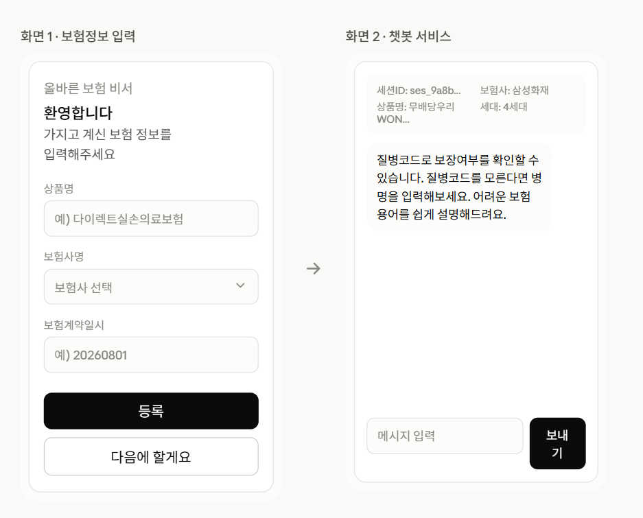

# 올바른 보험 비서 — 서비스 설계 문서



## 1. 서비스 흐름 개요

```
[진입]
  session_manager.session_id 생성 (create_at 기록)
        │
        ▼
[화면 1] 보험정보 입력 (선택)
  상품명 / 보험사명 / 보험계약일시 입력
        │
   ┌────┴────┐
 등록      다음에 할게요
   │            │
   ▼            ▼
[화면 2] 챗봇 서비스 화면
  (등록했다면 상단에 세션/상품 정보 요약 표시)
        │
        ▼
[이탈] session_manager.expires_at 기록
```

---

## 2. 화면별 와이어프레임 설명

### 화면 1 · 보험정보 입력

| 요소 | 타입 | 설명 |
|---|---|---|
| 타이틀 | 텍스트 | "가지고 계신 보험 정보를 입력해주세요" |
| 상품명 | input | placeholder: `예) 다이렉트실손의료보험` |
| 보험사명 | select | placeholder: `보험사 선택` |
| 보험계약일시 | input | placeholder: `예) 20260801` |
| 등록 버튼 | button | 입력값을 `insurance_product` / `insurance_user_info`에 저장 후 화면 2로 이동 |
| 다음에 할게요 버튼 | button | 저장 없이 화면 2로 이동 (스킵) |

### 화면 2 · 챗봇 서비스

| 요소 | 설명 |
|---|---|
| 상단 정보 바 | 보험정보를 입력한 경우에만 노출. `session_id`, 보험사명, 상품명, 세대 정보 표시 |
| 챗봇 인사말 | "질병코드로 보장여부를 확인할 수 있습니다. 질병코드를 모른다면 병명을 입력해보세요. 어려운 보험 용어를 쉽게 설명해드려요." |
| 채팅 입력창 + 보내기 버튼 | 입력한 질문에 대해 챗봇이 답변, `chatbot_count` 증가 |

---

## 3. 최종 DB 스키마

### session_manager (세션 관리)
| 컬럼 | 타입 | 제약 | 설명 |
|---|---|---|---|
| `session_id` | VARCHAR(255) | PK, NOT NULL | 세션 식별자 |
| `create_at` | TIMESTAMP | | 화면 진입 시점 |
| `expires_at` | TIMESTAMP | | 세션 종료 시점 |

### insurance_product (보험상품 마스터 — 카탈로그, 중복 저장 안 함)
| 컬럼 | 타입 | 제약 | 설명 |
|---|---|---|---|
| `product_id` | VARCHAR(50) | PK, NOT NULL | 상품 코드 (자동 생성, 아래 4.3 참고) |
| `product_name` | VARCHAR(255) | | 상품명 |
| `insurance_company` | VARCHAR(100) | | 보험사명 |
| `generation_type` | TINYINT | | 세대 정보 (1~4, 아래 4.2 참고) |

### insurance_user_info (세션별 입력/행동 기록)
| 컬럼 | 타입 | 제약 | 설명 |
|---|---|---|---|
| `session_id` | VARCHAR(255) | PK, FK → session_manager | 세션 식별자 |
| `product_id` | VARCHAR(50) | FK → insurance_product, NULL 허용 | 이 세션이 입력한 상품 (스킵 시 NULL) |
| `contracted_at` | TIMESTAMP | NULL 허용 | 이 세션이 입력한 보험 계약일시 |
| `action_type` | VARCHAR(20) | CHECK IN ('VISIT','INPUT_INFO','CHATBOT_USE') | 행동 유형 |
| `chatbot_count` | TINYINT | DEFAULT 0 | 챗봇 이용 횟수 |

**관계**
- `insurance_user_info.session_id` → `session_manager.session_id` (ON DELETE CASCADE)
- `insurance_user_info.product_id` → `insurance_product.product_id` (ON DELETE RESTRICT)

---

## 4. 핵심 로직 설명

### 4.1 세션 생명주기
1. 유저가 화면에 진입하면 고유한 `session_id`를 발급하고 `session_manager`에 `create_at`과 함께 기록
2. 유저가 화면을 벗어나면 `expires_at`을 기록해 세션을 종료 처리

### 4.2 세대(generation_type) 계산 규칙
`contracted_at`(보험 계약일시)을 기준으로 실손의료보험 표준 세대 구분을 적용합니다.

| 계약일시 | 세대 |
|---|---|
| ~ 2009.09.30 | 1세대 |
| 2009.10.01 ~ 2017.03.31 | 2세대 |
| 2017.04.01 ~ 2021.06.30 | 3세대 |
| 2021.07.01 ~ | 4세대 |

> 회사 내부 기준이 다르면 `seed_virtual_customers.py`의 `GENERATION_CUTOFFS` 값만 조정하면 됩니다.

### 4.3 product_id 생성 규칙
형식: `{보험사코드}{세대}G-{일련번호 4자리}` (예: 삼성화재·4세대·1번째 상품 → `SS4G-0001`)
- 자주 쓰는 보험사는 코드 매핑 테이블(`COMPANY_CODE_MAP`)을 사용
- 매핑에 없는 보험사는 이름을 해시하여 4자리 코드로 자동 생성
- 같은 보험사·세대 조합 내에서 기존 상품 개수를 세어 일련번호 부여

### 4.4 상품 중복 방지 로직
`product_name` + `insurance_company` 조합이 `insurance_product`에 이미 존재하면:
- 카탈로그에는 **새로 삽입하지 않음**
- 대신 기존 `product_id`를 조회해 `insurance_user_info.product_id`에 연결
→ 여러 세션이 같은 상품을 입력해도 `insurance_product`에는 한 줄만 유지됨

### 4.5 보험정보 입력은 선택사항
화면 1에서 "다음에 할게요"를 선택하면:
- `insurance_product`, `contracted_at` 관련 저장 없이 화면 2로 이동
- `insurance_user_info.product_id`, `contracted_at`은 `NULL`로 저장 (또는 행 자체를 생략하고 `action_type = VISIT`만 기록)
- 화면 2 상단 정보 요약 바는 노출되지 않음

### 4.6 챗봇 이용 기록
채팅 입력 시마다 `action_type`을 `CHATBOT_USE`로 갱신하고 `chatbot_count`를 1씩 증가시켜, 세션당 챗봇 이용 빈도를 추적합니다.

---

## 5. 관련 산출물
| 파일 | 설명 |
|---|---|
| `schema.sql` | MySQL DB/테이블 생성 스크립트 |
| `create_tables.py` | Python(pymysql)으로 DB/테이블을 생성하는 스크립트 |
| `schemas.py` | Pydantic 스키마 (Create/Update/Response) |
| `seed_virtual_customers.py` | 세대 계산, product_id 생성, 중복 방지 로직이 포함된 가상 고객 시딩 스크립트 |
